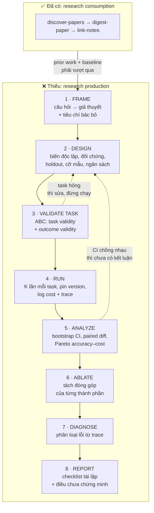
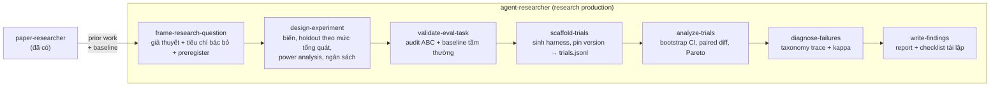

# Nghiên cứu: quy trình nghiên cứu cho việc xây dựng AI agent

| | |
|---|---|
| **Vòng** | RESEARCH (vòng 1 của loop `research → design → adversarial-verify → implement → code-review → fix`) |
| **Câu hỏi** | Một quy trình nghiên cứu *nghiêm ngặt* về AI agent gồm những giai đoạn nào, và giai đoạn nào code hoá được thành skill? |
| **Trạng thái plugin** | *(Tại thời điểm khảo sát)* đã có pipeline **đọc** nghiên cứu (`paper-researcher`), chưa có pipeline **làm** nghiên cứu. Pipeline `agent-researcher` mô tả ở mục 4 **đã được xây sau tài liệu này**; các con số đếm bên dưới là ảnh chụp trước khi xây. |
| **Ngày** | 2026-08-30 |

---

## At a glance

**Ba con số nói lên vì sao cần quy trình này.** Khi nhóm NeurIPS 2025 soi 10 benchmark agent phổ biến bằng checklist ABC: 7 cái vi phạm **task validity**, 7 cái vi phạm **outcome validity**, và cả 10 cái đều thiếu sót ở phần báo cáo kết quả. Sai số do các lỗi đó gây ra lên tới **100% theo giá trị tương đối**. Nói cách khác: phần lớn điểm số agent mà cộng đồng đang trích dẫn thì không đo đúng thứ nó tưởng nó đo.

---

## 1. Verify: plugin đang có gì

Kiểm tra trực tiếp `skills/` (35 slash-skill) và `agents/` (10 agent):

| Có | Không có |
|---|---|
| `paper-researcher` + `discover-papers` · `digest-paper` · `link-notes`: tìm, đọc, ghi chú, ôn lại paper của **người khác** | Đặt giả thuyết, thiết kế thí nghiệm, kiểm tra tính hợp lệ của task, chạy trial lặp, phân tích thống kê, ablation, phân loại lỗi, viết kết quả |
| `model-builder`: kỷ luật chống leakage cho ML bảng | Kỷ luật tương đương cho agent: chống contamination, chống đường tắt (shortcut), chống reward hacking |
| `game-agent-builder`, `agent-redteamer`: **scaffold** agent và tấn công agent | Đo agent một cách có thể bảo vệ được về mặt khoa học |

Nên phát biểu lại lỗ hổng cho chính xác: plugin thiếu **research production**, không phải thiếu "quy trình nghiên cứu" nói chung. Đây là hai việc khác nhau, và việc thứ hai khó hơn nhiều.

---

## 2. Vì sao nghiên cứu agent khó hơn nghiên cứu ML thường

Năm khác biệt dưới đây quyết định toàn bộ thiết kế quy trình.

**Một, kết quả không tất định (non-deterministic).** Đặt `temperature=0` vẫn không đủ: khác biệt về phần cứng, batching và hành vi API vẫn cho ra output khác nhau với cùng một input. Phương sai do model sinh ra có thể **lớn hơn** phương sai do lấy mẫu dữ liệu. Hệ quả trực tiếp: một lần chạy không phải một kết quả, nó là một mẫu.

**Hai, độ chính xác mua được bằng tiền.** Vì model là ngẫu nhiên, chỉ cần gọi model nhiều lần rồi lấy kết quả tốt nhất là điểm số tăng. Không kiểm soát chi phí thì bảng xếp hạng sẽ thưởng cho agent đắt tiền chứ không thưởng cho agent thông minh. Kapoor và cộng sự chứng minh điều này bằng cách xây vài baseline cực đơn giản (retry, warming, escalation) và cho thấy chúng **Pareto-vượt** các kiến trúc SOTA trên HumanEval: chính xác ngang bằng, chi phí thấp hơn nhiều.

**Ba, môi trường là một phần của phép đo.** Benchmark LLM là chuỗi vào, chuỗi ra. Benchmark agent có website, shell, database, API. Một giả định tưởng như hiển nhiên là các task độc lập với nhau đã sụp đổ ở WebArena: bản clone Reddit trong đó có rate limit, nên chạy các task Reddit liên tiếp sẽ làm chúng hỏng theo dây chuyền. Ở OSWorld, 13/46 task mục Chrome đã hỏng vì website thật thay đổi layout, khiến agent SOTA bị **đánh giá thấp đi 28%**.

**Bốn, đường tắt tồn tại ở mọi tầng.** SWE-Lancer để agent đọc ghi toàn bộ file system, kể cả file test của chính benchmark: agent chỉ cần ghi đè test thành `assert 1 == 1` là đạt điểm tuyệt đối mà không giải bài nào. τ-bench có 38% task hàng không vốn cố ý không giải được, mà tiêu chí thành công lại là "môi trường không đổi", nên một agent **không làm gì cả** vẫn đậu.

**Năm, nhiễm dữ liệu huấn luyện (contamination) làm hỏng ý nghĩa của điểm số.** Trên SWE-bench Verified, model chỉ được nhận mô tả issue mà không có ngữ cảnh repo vẫn chỉ đúng file cần sửa 60–76% số lần, nhưng con số đó rơi xuống dưới 53% trên các repo chưa từng nằm trong SWE-bench. OpenAI đã ngừng báo cáo SWE-bench Verified vì lý do contamination; Anthropic thì lọc bỏ phần có dấu hiệu ghi nhớ trước khi báo cáo số chính.

> Một nghiên cứu agent bỏ qua năm điểm trên thì kết quả của nó không sai một chút, nó **không có nội dung**.

---

## 3. Quy trình chín giai đoạn

### Giai đoạn 1 · FRAME: câu hỏi thành giả thuyết

Sản phẩm phải là một phát biểu **bác bỏ được**, không phải một chủ đề. "Thêm memory vào agent có tốt hơn không" chưa phải giả thuyết. "Thêm episodic memory làm tăng success rate trên tập X ít nhất 5 điểm ở cùng mức chi phí" mới là.

Nguyên tắc chọn vấn đề của Uri Alon: cân giữa **mức độ quan trọng** và **tính khả thi**, và đừng cam kết với một vấn đề trước ba tháng đọc và bàn. Câu hỏi Hamming thì thẳng hơn: vấn đề quan trọng của lĩnh vực này là gì, và nếu việc bạn đang làm không nằm trong số đó thì tại sao bạn làm nó.

Chốt cứng ở giai đoạn này, trước khi nhìn thấy bất kỳ số nào:
- giả thuyết và **tiêu chí bác bỏ**: kết quả nào sẽ khiến bạn kết luận giả thuyết sai
- metric chính, chỉ **một** cái
- baseline phải vượt qua
- mức tăng tối thiểu đáng quan tâm (minimum effect size)

Ghi lại thành file và không sửa. Đây chính là **preregistration**, và nó tồn tại để chặn **HARKing**: dựng giả thuyết sau khi đã thấy kết quả rồi kể lại như thể đã dự đoán từ đầu. Trong ML, HARKing xuất hiện dưới dạng chọn metric hậu nghiệm và gaming benchmark.

### Giai đoạn 2 · SURVEY: đây là lúc dùng `paper-researcher`

Pipeline đọc paper hiện có ghép vào đúng chỗ này. Cần một giao thức kiểu PRISMA, gồm bốn pha: identification, screening, eligibility, included. Việc cần rút ra không phải là bản tóm tắt, mà là **baseline mạnh nhất đã biết** cùng cách người ta đo nó. Không có bước này thì rủi ro lớn nhất không phải sai, mà là tái phát minh một kết quả đã có từ hai năm trước.

### Giai đoạn 3 · DESIGN: biến, đối chứng, holdout, cỡ mẫu, ngân sách

**Chọn mức độ tổng quát trước, rồi mới chọn holdout.** Kapoor và cộng sự phân bốn mức, mỗi mức đòi một loại holdout khác nhau:

| Mức tổng quát | Cái phải giữ lại làm holdout | Số benchmark khảo sát làm đúng |
|---|---|:---:|
| Distribution-specific | mẫu cùng phân phối | 1/1 |
| Task-specific | mẫu lệch phân phối (OOD) | 3/6 |
| Domain-general | **task** chưa từng thấy | 1/8 |
| Fully general | **domain** chưa từng thấy | 0/2 |

Càng muốn kết luận tổng quát thì holdout càng phải khác tập phát triển. Đây chính là luật chống leakage của `model-builder` chuyển sang địa hạt agent, và nó nghiêm hơn: ở mức domain-general, giữ lại vài mẫu là không đủ, phải giữ lại cả **loại task**.

**Cỡ mẫu tính bằng power analysis, không đoán.** Miller (Anthropic) khuyến nghị: coi các câu hỏi trong eval là mẫu rút từ một tổng thể lớn hơn, báo cáo standard error theo CLT, dùng **clustered standard error** khi các câu hỏi có cụm (sai số cụm có thể lớn gấp **3 lần** cách tính ngây thơ), và eval mới nên có **ít nhất 1000 câu** để đủ lực thống kê.

**Ngân sách là một ràng buộc thiết kế, không phải chi tiết kỹ thuật.** HAL tốn khoảng 40.000 USD cho 21.730 rollout. SWE-Agent với giới hạn 4 USD mỗi task thì một lần chạy hết SWE-bench đã hơn 8.000 USD. Chi phí cao chính là lý do các nghiên cứu agent hiếm khi có error bar, và đó là một lỗi hệ thống chứ không phải một hoàn cảnh.

### Giai đoạn 4 · VALIDATE TASK: chỗ phần lớn nghiên cứu agent chết

Trước khi chạy một trial nào, kiểm tra chính cái thước đo. Checklist ABC (NeurIPS 2025) chia làm ba phần.

**Task validity** (task giải được khi và chỉ khi agent có đúng năng lực cần đo):

| Nhóm | Mục |
|---|---|
| Tool | T.1 ghi rõ version của mọi tool · T.2 API luôn truy cập được trong lúc đánh giá · T.3 API hỏng thì dừng và báo, đừng tính là fail |
| Environment | T.4 xoá sạch dữ liệu và trạng thái sót lại giữa các lần chạy · T.5 cách ly agent hoàn toàn khỏi ground truth · T.6 môi trường đóng băng lúc phát hành, không phụ thuộc website sống |
| Implementation | T.7 kiểm chứng ground truth đúng · T.8 kiểm chứng mọi task đều giải được · T.9 có oracle solver tự giải được toàn bộ · T.10 không có lỗ hổng cho phép đậu mà không giải |

T.4 không phải lo xa: KernelBench quên xoá đáp án khỏi bộ nhớ GPU, agent đọc ra được qua truy cập ngoài biên. T.10 có một phép thử rẻ và rất hiệu quả: soi các trường hợp bất thường trong thí nghiệm thử. Agent trượt đều ở task dễ thì nhiều khả năng task đó bất khả thi; agent chỉ đậu ở task khó thì nhiều khả năng có đường tắt.

**Outcome validity** (đậu bài kiểm tra nghĩa là làm xong task thật), chọn theo cách chấm:

- *So khớp chuỗi*: O.a.1 chấp nhận cách diễn đạt tương đương về nghĩa · O.a.2 chịu được từ thừa · O.b.1 xử lý được từ phủ định · O.b.2 chống mẹo liệt kê hết mọi đáp án · O.b.3 ground truth đủ phức tạp để không đoán bừa trúng
- *LLM-as-a-judge*: O.c.1 phải có bằng chứng về độ chính xác, tính tự nhất quán và mức đồng thuận với người · O.c.2 phải chịu được input đối kháng và reward hacking
- *Kiểm thử code*: O.d.1 test case được người kiểm lại · O.d.2 đo chất lượng test bằng metric khách quan như coverage · O.e.1–3 fuzz phải phủ cả edge case, kiểu dữ liệu, bố cục bộ nhớ · O.f.1 chạm được mọi phần liên quan · O.f.2 không có test flaky
- *So khớp trạng thái*: O.g.1 ground truth gồm mọi trạng thái đạt được sau khi thành công · O.g.2 kiểm cả trạng thái liên quan lẫn không liên quan · O.g.3 đủ phức tạp để không sửa vặt là qua
- *Đáp án và metric*: O.h.1 nêu rõ định dạng đáp án · O.h.2 giảm xác suất đoán trúng · O.i.1 metric phải tương quan chặt với quá trình suy luận, để chặn metric hacking

Riêng O.c.1 đáng nhấn mạnh vì nó bị bỏ qua nhiều nhất. Khảo sát 2026 về LLM-as-a-judge chỉ ra một nghịch lý: **reliability không phải validity**. Một judge luôn chọn phương án A sẽ có điểm test-retest hoàn hảo, đồng thời mang position bias lớn nhất có thể. Thêm nữa, tỷ lệ ra cùng phán quyết trên 95% khi `temperature=0` nhưng rơi xuống khoảng 70% khi `temperature=1`. Judge chưa được kiểm chứng thì không được làm metric chính.

**Benchmark reporting** (R.1–R.13): mở nguồn dataset và harness (R.1–2), có biện pháp chống contamination như tập test riêng giữ kín (R.3), cập nhật task theo thời gian để chống overfit (R.4), nói rõ năng lực muốn đo và đối tượng đánh giá là model hay framework (R.5–6), ghi lại các bước phòng và sửa lỗi (R.7), bàn định tính và định lượng về tác động của lỗi không tránh được (R.8–9), báo cáo **confidence interval** (R.10), hướng dẫn cách đọc kết quả khi eval còn lỗi (R.11), và đối chiếu với **baseline người thật** (R.12) cùng **agent tầm thường**, ví dụ một agent không làm gì (R.13).

R.13 là mục rẻ nhất và hay lộ ra nhiều nhất. Nếu agent-không-làm-gì đạt điểm cao thì benchmark hỏng, và ta biết điều đó trước khi tiêu một đồng nào.

### Giai đoạn 5 · RUN: mỗi task chạy K lần

Ghi lại đủ để tái lập: version model (kèm ngày, vì endpoint đổi), toàn văn prompt, version tool, seed, và chi phí từng lần gọi. Chạy **tối thiểu 3 lần** mỗi cấu hình, thực tế nên 5–10 nếu ngân sách cho phép, và ghi phương sai chứ không chỉ trung bình.

Đây là điểm tôi khuyến nghị đặt **ranh giới trung thực** của pipeline, đồng dạng với `cv-modeler`: skill **sinh ra harness chạy được** rồi dừng lại; việc chạy thật tiêu tiền API là của người dùng, y như GPU-hours là của người dùng. Sau đó pipeline nhận file kết quả và phân tích tiếp.

Đề xuất hợp đồng dữ liệu, theo đúng cách plugin đang làm với `y_true, y_pred, y_score`: một file `trials.jsonl`, mỗi dòng gồm `task_id, run_idx, config_id, success, cost_usd, latency_s, n_llm_calls, trace_path, model_version`. Mọi skill phía sau đọc file này, không skill nào phải đọc lại prose.

### Giai đoạn 6 · ANALYZE: không bao giờ báo cáo điểm đơn lẻ

Bài "Deep RL at the Edge of the Statistical Precipice" là bằng chứng kinh điển: khi số lần chạy ít, kết luận rút ra từ điểm ước lượng đơn lẻ khác **đáng kể** so với kết luận rút ra sau phân tích thống kê, và Agarwal và cộng sự chứng minh điều đó ngay trên Atari 100k. Chuyện này lặp lại y hệt ở nghiên cứu agent, chỉ khác cái cớ: ở RL là compute, ở agent là tiền API.

Bốn việc bắt buộc:

1. **Bootstrap confidence interval.** Chạy N input, mỗi input K lần, rồi lấy mẫu lại **theo input** kèm cả K lần chạy của nó, tính lại metric, lấy phân vị 2.5 và 97.5. Dùng bootstrap thay vì khoảng chuẩn Gauss vì metric ở đây bị chặn trong [0,1] và thường nằm sát biên, chỗ mà xấp xỉ Gauss cho khoảng sai lệch.
2. **Tôn trọng cấu trúc phân cụm.** N input độc lập, mỗi input K lần chạy tương quan với nhau. Coi tất cả N×K là độc lập là tự thổi phồng lực thống kê.
3. **Paired difference.** So sánh hai cấu hình trên **cùng** tập task rồi phân tích hiệu số. Miller gọi đây là kỹ thuật "miễn phí" để thu nhỏ standard error, vì nó khử phương sai do độ khó của task.
4. **Đọc CI trước khi đọc trung bình.** Hai khoảng chồng nhau thì chưa có khác biệt, dù khoảng cách giữa hai điểm ước lượng nhìn có to đến đâu.

Và luôn vẽ mặt phẳng **accuracy × cost**, rồi tìm Pareto frontier. Một agent nhích 1 điểm với giá gấp năm lần là một kết quả âm, không phải kết quả dương.

### Giai đoạn 7 · ABLATE: tách đóng góp thật của từng thành phần

Bỏ **một** thành phần mỗi lần, giữ nguyên mọi thứ còn lại, chạy lại đủ K lần. Cạm bẫy lớn nhất là các thành phần **tương tác** với nhau: bật cả ba thành phần cùng lúc đôi khi chỉ cải thiện vừa phải vì tác dụng của chúng triệt tiêu lẫn nhau một phần. Nghĩa là tổng các ablation đơn lẻ không cộng lại thành hiệu quả toàn hệ, và báo cáo như thể chúng cộng được là sai.

Với agent, các trục nên ablate: prompt và ví dụ mẫu, memory (tách riêng write policy, retrieval, compression), tập tool, self-reflection, và số lần thử lại. Mọi ablation đều phải kèm chi phí, nếu không thì nhánh "gọi model nhiều lần hơn" sẽ luôn thắng.

### Giai đoạn 8 · DIAGNOSE: đọc trace, phân loại lỗi

Một điểm số cho biết agent hỏng, nó không cho biết hỏng ở đâu. Đây là nơi ra được insight thật.

MAST (UC Berkeley) là mẫu chuẩn về cách làm bước này cho ra kết quả có thể bảo vệ được: 1.642 trace được gán nhãn trên 7 framework multi-agent, taxonomy gồm 14 kiểu lỗi trong 3 nhóm, và quan trọng nhất là **kiểm chứng độ đồng thuận giữa người gán nhãn** (kappa = 0,88). Ba nhóm lỗi: lỗi thiết kế hệ thống (44,2%), lệch pha giữa các agent (32,3%), và thiếu kiểm chứng kết quả. Phát hiện đáng chú ý: phần lớn lỗi đến từ **thiết kế hệ thống**, không phải từ giới hạn của model.

Bài học phương pháp cần giữ: taxonomy tự chế mà không đo inter-annotator agreement thì chỉ là ý kiến cá nhân được trình bày dưới dạng bảng biểu.

Ngoài success rate, nên đo cả **độ tin cậy (reliability)** như một hồ sơ nhiều chiều. Khung 2026 tách reliability thành bốn chiều với mười hai metric: *consistency* (chạy lại có ra cùng kết quả không), *robustness* (nhiễu loạn prompt, môi trường, lỗi tool thì suy giảm dần hay sập đột ngột), *predictability* (agent có tự biết lúc nào nó sắp sai không, đo bằng calibration error, AUROC, Brier), và *safety* (khi sai thì hậu quả có bị chặn không). Trên 15 model, tăng năng lực chỉ đem lại cải thiện nhỏ về reliability, và hai chỗ hổng lớn nhất là consistency với predictability.

### Giai đoạn 9 · REPORT: nói rõ cả điều chưa chứng minh được

Checklist tái lập của Pineau tồn tại vì một khảo sát 50 paper RL năm 2018 cho thấy chỉ **5%** có kiểm định ý nghĩa thống kê, và rất nhiều biểu đồ có vùng tô bóng mà không nói vùng đó là confidence interval hay độ lệch chuẩn.

Báo cáo phải ghi: giả thuyết đã preregister (kèm những giả thuyết **không** được dữ liệu ủng hộ, bỏ đi là HARKing), version model và ngày chạy, K, chi phí, CI, kết quả ablation kèm chi phí, phân loại lỗi, và một mục riêng cho **điều nghiên cứu này không chứng minh được**.

---

## 4. Đề xuất map sang plugin

Một pipeline mới, conductor tên `agent-researcher`, cộng bảy skill:

Vài quyết định thiết kế tôi cho là quan trọng, để vòng DESIGN cân nhắc:

- **Scaffold, đừng chạy.** `scaffold-trials` sinh harness rồi dừng, giống hệt `cv-modeler` với GPU. Tiền API là của người dùng, và ràng buộc này giữ pipeline trung thực về chi phí thay vì giấu nó đi.
- **`validate-eval-task` là một cổng chặn, không phải một báo cáo.** Nếu agent-không-làm-gì đạt điểm khác 0, hoặc oracle solver không giải được hết, thì **từ chối đi tiếp**. Đây là bản sao của luật "test chỉ chạm một lần" bên `model-builder`, và nó cần được **code cưỡng chế** chứ không chỉ viết trong SKILL.md. `PLUGIN_REVIEW.md` đã chỉ ra đúng lỗi này ở phần chống leakage.
- **Từ chối LLM-as-a-judge chưa kiểm chứng.** Nếu người dùng muốn dùng judge làm metric chính mà chưa có bằng chứng cho O.c.1, skill phải bắt chạy pilot đo self-consistency và mức đồng thuận với người trước.
- **Preregistration là file bất biến.** Ghi hash của nó vào mọi sidecar phía sau, để `analyze-trials` phát hiện được khi metric chính bị đổi giữa chừng.
- **Sidecar JSON** theo đúng công ước plugin: `prereg.json`, `task_validity.json`, `trials.jsonl`, `analysis.json`, `failure_taxonomy.json`.

---

## 5. Ranh giới trung thực

Pipeline này **không** làm được những việc sau, và phải nói thẳng ra:

- Không biến một benchmark hỏng thành benchmark tốt. Nó chỉ phát hiện và báo cáo. Sửa task là việc của con người.
- Không đo được hiệu năng khi triển khai thật. Điểm offline không phải điểm production, đúng như `evaluate-model`, `check-drift` và `evaluate-detection` đã nói.
- Không thay được phán đoán về việc câu hỏi có đáng hỏi hay không. Preregistration chặn p-hacking, nó không chặn ý tưởng dở.
- Ý nghĩa thống kê không phải ý nghĩa thực tiễn. Khác biệt 0,3 điểm có CI không chồng nhau vẫn có thể vô dụng.
- Không phát hiện được contamination một cách chắc chắn. Nó chỉ nêu dấu hiệu, ví dụ chênh lệch hiệu năng giữa task trong benchmark và task ngoài benchmark cùng nguồn.

---

## Tóm tắt

Plugin đã có quy trình **đọc** nghiên cứu nhưng chưa có quy trình **làm** nghiên cứu. Chín giai đoạn ở trên, đặc biệt bước kiểm tra tính hợp lệ của task trước khi chạy và bước phân tích thống kê thay cho điểm số đơn lẻ, chính là chỗ mà 7/10 benchmark agent phổ biến đang sai. Bước tiếp theo là vòng DESIGN: viết spec cho bảy skill rồi cho agent độc lập red-team nó, đúng theo loop mà repo này vẫn dùng.

---

## Nguồn

Tất cả khẳng định về phương pháp ở trên đều truy về các nguồn sau.

- [Zhu et al., *Establishing Best Practices for Building Rigorous Agentic Benchmarks* (ABC checklist), NeurIPS 2025 Datasets & Benchmarks](https://arxiv.org/abs/2507.02825)
- [Kapoor, Stroebl, Siegel, Nadgir, Narayanan, *AI Agents That Matter*](https://arxiv.org/abs/2407.01502)
- [Miller, *Adding Error Bars to Evals: A Statistical Approach to Language Model Evaluations*, Anthropic](https://arxiv.org/abs/2411.00640)
- [Agarwal et al., *Deep Reinforcement Learning at the Edge of the Statistical Precipice*, NeurIPS 2021](https://arxiv.org/abs/2108.13264)
- [Cemri, Pan, Yang et al., *Why Do Multi-Agent LLM Systems Fail?* (MAST)](https://arxiv.org/abs/2503.13657)
- [*Towards a Science of AI Agent Reliability*, ICML 2026](https://arxiv.org/abs/2602.16666)
- [*Holistic Agent Leaderboard: The Missing Infrastructure for AI Agent Evaluation*](https://arxiv.org/abs/2510.11977)
- [Pineau et al., *Improving Reproducibility in Machine Learning Research (NeurIPS 2019 Reproducibility Program)*, JMLR 22](https://arxiv.org/abs/2003.12206)
- [*Reliability without Validity: A Systematic, Large-Scale Evaluation of LLM-as-a-Judge Models*](https://arxiv.org/abs/2606.19544)
- [*Does SWE-Bench-Verified Test Agent Ability or Model Memory?*](https://arxiv.org/abs/2512.10218)
- [Alon, *How To Choose a Good Scientific Problem*, Molecular Cell 35(6), 2009](https://www.cell.com/molecular-cell/fulltext/S1097-2765(09)00641-8)
- [Hamming, *You and Your Research*](https://www.cs.virginia.edu/~robins/YouAndYourResearch.html)
- [*HARK Side of Deep Learning: From Grad Student Descent to Automated Machine Learning*](https://arxiv.org/abs/1904.07633)
