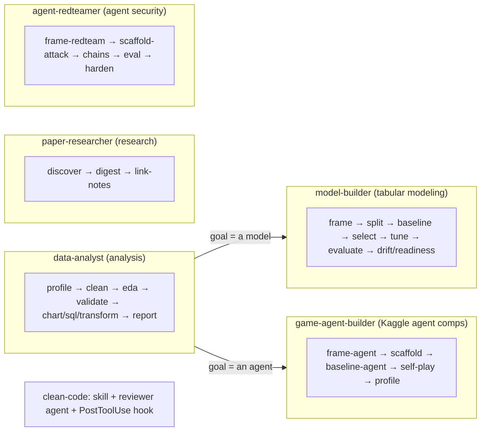

# CLAUDE.md — claude-all-in-one-plugin

A Claude Code **plugin**: conductor *agents* drive *skills* (bundled Python scripts + `SKILL.md`) across end-to-end pipelines — **data analysis**, **tabular ML modeling**, **paper-reading research**, **Kaggle agent-competition building**, and **authorized agent-security red-teaming** — plus a reactive **code-quality** layer. See [README.md](README.md) for the full catalog.

## Layout
- `skills/<name>/SKILL.md` (+ optional `scripts/*.py`) — one bounded capability each. **30 slash-skills** (each has a `SKILL.md`); `skills/verify-analysis/` is a 31st dir that ships only a bundled `stat_tests.py` (no `SKILL.md`, driven by the `verify-analysis` agent).
- `agents/<name>.md` — conductor/specialist subagents. 9 agents.
- `hooks/hooks.json` + `hooks/clean-code-reminder.py` — one PostToolUse hook (clean-code nudge on source edits).
- `.claude-plugin/{plugin.json,marketplace.json}` — plugin + marketplace manifests.

## Conventions when adding / editing a skill
- **`SKILL.md` frontmatter:** `name`, `description` (rich, ending with a "Use when …" trigger), `allowed-tools`.
- **Body:** `When to use` · `Contract` (hard rules) · `Steps` · `Output style` · `Grounding` (cite the sources behind any methodology claim).
- **Scripts are self-contained.** Cross-script helpers are **copied byte-identical**, never imported across skill folders, and `tests/check_helpers_synced.py` **enforces** it (run it after touching any copied helper — it is the source of truth for the groups). Current groups: modeling (`load`, `find_split`, `infer_task`, `build_preprocessor`, `clf_metrics`/`reg_metrics`, `fmt`); agentic (`agent_count`, `outcome`, a simpler `{:.3f}` `fmt`); the offensive-security gate (`enforce_authorized_scope`, identical across the three offensive skills); the research retry helper (`http_get_bytes` — backoff/Retry-After on 429/5xx + read timeouts); and the shared utilities (`die`, `eprint`).
- **Every generated report OPENS with `## At a glance` + a Mermaid block** (hard rule — the maintainer is a visual learner).
- **Emit a machine-readable sidecar** next to any human report (e.g. `baseline_metric.json`, `split_summary.json`, `drift_summary.json`, `tuned_metric.json`) so downstream skills/agents parse JSON, never scrape prose.
- **Composition contract:** predictions files use columns `y_true, y_pred[, y_score]` + feature columns, primary metric `f1_macro` (classification) / `mae` (regression), so `baseline`/`train-tune` output feeds `evaluate-model`/`check-drift` unchanged.
- **Be bounded and honest.** Each skill scopes out and plainly refuses what it can't do (e.g. `evaluate-model`/`check-drift` state they cannot measure online performance or concept drift without labels). Never present offline metrics as production/business performance.
- **Modeling discipline (sacred):** preprocessing fit on **train only** (inside the CV pipeline); the **test split is touched once**, at the very end; baseline before complexity.
- **Agentic pipelines scaffold — they don't train or serve.** The game-agent and agent-security skills **scaffold · evaluate · profile · harness**; they do NOT train deep-RL agents (GPU-hours — defer to SB3/CleanRL) or run the live Kaggle ladder. The runtime is `kaggle_environments` (env id discovered from the comp, never hardcoded — Pokemon TCG's env is `cabt`, not `pokemon_tcg`; its engine is a Linux binary that won't run on macOS). Honesty boundary, like the modeling one: a local self-play rating ≠ Kaggle standing; an offline ASR ≠ production security. The **agent-security** pipeline is **dual-use → bounded**: per-skill authorization refusals (sandbox/competition/owned-systems only; no production targets, named products, or other competitors), `build-attack-chains` is predicate-locked, metrics are judge-free deterministic predicates, and `agent-redteamer` gates on a one-time authorization attestation. Start scripted before RL (scripted bots often beat RL under comp time limits); the generated bundle must never crash / always return a legal move (a specific first-legal fallback) / honor a cumulative time budget.

## Conventions when adding / editing an agent
- Frontmatter uses `tools:` (not `allowed-tools`) + a `description` with a "Use when" trigger.
- Agents are **conductors**: a subagent can't spawn subagents, so inline each skill's steps and defer to the `SKILL.md` for detail. **Stop at human-decision checkpoints.** Never modify source data. (`model-builder` stays tabular and refuses RL/agents → agent work routes to `game-agent-builder` / `agent-redteamer`.)

## Python environment
Use the project venv for all script steps: `.venv/bin/python`. Create once if missing:
`python3 -m venv .venv && .venv/bin/pip install -q pandas numpy scikit-learn scipy openpyxl pyarrow matplotlib duckdb`
(`readiness_check.py` and `cleaning-report/report.py` are stdlib-only.) The **game-agent** scripts need `kaggle-environments` to run episodes (else they exit 2 with an install hint; the submission bundle still generates without it); `trueskill` is optional (else stdlib ELO). The **agent-security** harness is stdlib + a built-in `mock` target; real targets / `agentdojo` / `injecagent` are optional, user-supplied.

## Don't commit
`.gitignore` excludes `data/` (test datasets), `.venv/`, `.claude/` (local Claude state), `__pycache__/`, generated analysis/modeling artifacts (`*_splits/`, `problem_framing_brief.md`, `*_clean.*`), and the agentic artifacts (`*_submission/`, `submission*.tar.gz`, `agent_task.json`, `*_ladder*`, `*_attack/`, `attack_chains.json`, `redteam_*`, `defended_target.py`, …). Source data is never modified by any skill.

## How this codebase is extended (recommended)
New skills/agents here are built **research → design → adversarial-verify → implement → code-review → fix**: ground methodology claims in cited sources, draft a spec, have independent agents red-team it, then verify the implementation against the real files before trusting it. This caught real bugs every round (leakage, small-sample PSI inflation, false-PASS audits; and in the agentic pipelines: a wrong `kaggle_environments` player-count, an unverifiable competition interface, and dual-use gaps) — keep the loop.
