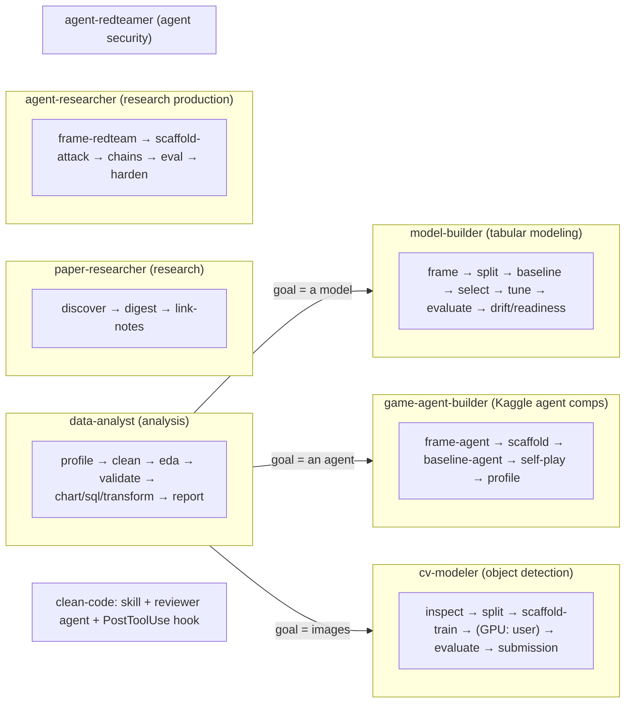

# CLAUDE.md — claude-all-in-one-plugin

A Claude Code **plugin**: conductor *agents* drive *skills* (bundled Python scripts + `SKILL.md`) across end-to-end pipelines — **data analysis**, **tabular ML modeling**, **paper-reading research**, **AI-agent research production**, **Kaggle agent-competition building**, **authorized agent-security red-teaming**, and **object-detection computer vision** — plus a reactive **code-quality** layer. See [README.md](README.md) for the full catalog.

## Layout
- `skills/<name>/SKILL.md` (+ optional `scripts/*.py`) — one bounded capability each. **42 slash-skills** (each has a `SKILL.md`); `skills/verify-analysis/` is a 43rd dir that ships only a bundled `stat_tests.py` (no `SKILL.md`, driven by the `verify-analysis` agent).
- `agents/<name>.md` — conductor/specialist subagents. 11 agents.
- `hooks/hooks.json` + `hooks/clean-code-reminder.py` — one PostToolUse hook (clean-code nudge on source edits).
- `.claude-plugin/{plugin.json,marketplace.json}` — plugin + marketplace manifests.

## Conventions when adding / editing a skill
- **`SKILL.md` frontmatter:** `name`, `description` (rich, ending with a "Use when …" trigger), `allowed-tools`.
- **Body:** `When to use` · `Contract` (hard rules) · `Steps` · `Output style` · `Grounding` (cite the sources behind any methodology claim).
- **Scripts are self-contained.** Cross-script helpers are **copied byte-identical**, never imported across skill folders, and `tests/check_helpers_synced.py` **enforces** it (run it after touching any copied helper — it is the source of truth for the groups). Two further suites guard the research pipeline: `tests/check_research_gates.py` (22 attacks a review round actually landed — every refusal in `agent-researcher` is locked down there, because a silently weakened refusal does not crash, it returns a confident wrong answer) and `tests/measure_bootstrap_calibration.py` (the *source* of the calibration figures quoted in `analyze-trials`; never quote a calibration number this script has not printed). Current groups: modeling (`load`, `find_split`, `infer_task`, `build_preprocessor`, `clf_metrics`/`reg_metrics`, `fmt`); agentic (`agent_count`, `outcome`, a simpler `{:.3f}` `fmt`); the offensive-security gate (`enforce_authorized_scope`, identical across the three offensive skills); the research retry helper (`http_get_bytes` — backoff/Retry-After on 429/5xx + read timeouts); the research-production pair (`prereg_hash` — the anti-HARKing hash, whose drift would silently break the whole preregistration guarantee; and `load_trials`); and the shared utilities (`die`, `eprint`).
- **Every generated report OPENS with `## At a glance` + a Mermaid block** (hard rule — the maintainer is a visual learner).
- **Emit a machine-readable sidecar** next to any human report (e.g. `baseline_metric.json`, `split_summary.json`, `drift_summary.json`, `tuned_metric.json`) so downstream skills/agents parse JSON, never scrape prose.
- **Composition contract:** predictions files use columns `y_true, y_pred[, y_score]` + feature columns, primary metric `f1_macro` (classification) / `mae` (regression), so `baseline`/`train-tune` output feeds `evaluate-model`/`check-drift` unchanged.
- **Be bounded and honest.** Each skill scopes out and plainly refuses what it can't do (e.g. `evaluate-model`/`check-drift` state they cannot measure online performance or concept drift without labels). Never present offline metrics as production/business performance.
- **Modeling discipline (sacred):** preprocessing fit on **train only** (inside the CV pipeline); the **test split is touched once**, at the very end; baseline before complexity.
- **Agentic pipelines scaffold — they don't train or serve.** The game-agent and agent-security skills **scaffold · evaluate · profile · harness**; they do NOT train deep-RL agents (GPU-hours — defer to SB3/CleanRL) or run the live Kaggle ladder. The runtime is `kaggle_environments` (env id discovered from the comp, never hardcoded — Pokemon TCG's env is `cabt`, not `pokemon_tcg`; its engine is a Linux binary that won't run on macOS). Honesty boundary, like the modeling one: a local self-play rating ≠ Kaggle standing; an offline ASR ≠ production security. The **agent-security** pipeline is **dual-use → bounded**: per-skill authorization refusals (sandbox/competition/owned-systems only; no production targets, named products, or other competitors), `build-attack-chains` is predicate-locked, metrics are judge-free deterministic predicates, and `agent-redteamer` gates on a one-time authorization attestation. Start scripted before RL (scripted bots often beat RL under comp time limits); the generated bundle must never crash / always return a legal move (a specific first-legal fallback) / honor a cumulative time budget.
- **Research production is preregistered and gated.** `agent-researcher` produces original findings about agents (distinct from `paper-researcher`, which consumes papers). Three rules are **code-enforced, not prose**: (1) `frame-research-question` locks one primary metric, a `min_effect > 0` and a falsification criterion behind an immutable `prereg_hash`, stamped on every trial row — `analyze-trials` and `write-findings` **refuse the confirmatory claim** on mismatch (that is HARKing detection; amendments are recorded via `--amend`, never hidden). (2) `validate-eval-task` is a **hard gate** (exit 5) implementing the Agentic Benchmark Checklist plus two empirical checks a questionnaire can't fake — a trivial do-nothing agent must score ~0 and an oracle must solve 100% — and `scaffold-trials` **refuses** without `gate: PASS`. 7/10 audited agent benchmarks violate task validity and 7/10 outcome validity, with errors to 100% relative (τ-bench's do-nothing agent passes 38%; SWE-Lancer's tests are overwritable). (3) **Never a point estimate**: CIs come from a bootstrap that resamples **tasks** carrying their K runs (calibration **measured** by `tests/measure_bootstrap_calibration.py`: FPR 0.049 at the enforced 30-shared-task floor, 0.077 at 20, 0.132 at 5, against a nominal 0.05), always paired where possible, always with cost beside accuracy — accuracy is purchasable by re-calling a stochastic model. The holdout level must match the claimed generality (distribution → OOD → unseen tasks → unseen domains) or the design is refused. A preregistered **null is a finding** and gets reported; a failure taxonomy without two annotators and Cohen's κ is an opinion, not a result. Honesty boundary as everywhere else: **offline held-out score ≠ deployment ≠ leaderboard**. **Like `cv-modeler`, it scaffolds but does not run** — the rollouts are the user's API spend.
- **The CV pipeline scaffolds too — it doesn't train the model.** `cv-modeler` (object detection) **scaffolds · evaluates · formats submissions**; it generates a runnable Ultralytics YOLO transfer-learning bundle + a CPU smoke test, but the real GPU training is the **user's** (Ultralytics/MMDetection both say CPU training is too slow). Same honesty boundary: an offline **mAP ≠ leaderboard ≠ deployable operating point**. The **sacred leakage rule ports to images**: `split-images` groups by SOURCE (never a per-image random split when a group exists), **consumes `inspect-images`' augmentation-aware near-dup clusters** so rotated/near-identical copies can't straddle folds, and its real check is `dup_clusters_straddling_folds==0` (the `groups_straddling==0` check is tautological — GroupKFold never straddles the key you give it). A per-image split is **refused** unless explicitly acked, then stamped `per-image-ACKED-leaky` and propagated so `evaluate-detection` marks the mAP inflated. 16-bit imagery is normalized **per-image** to 8-bit (never silently truncated, never dataset-global stats = leak); COCO category ids are remapped to **0-based contiguous** via one shared `class_map.json` consumed by train/eval/submission (never the naive `id-1`); YOLO box coords come from `boxes.xyxy` (top-left), never the center-based `boxes.xywh`. **Vision-model security / machine-unlearning is OUT OF SCOPE** (a poisoned-model sub-task is unresearched — never scaffold it, not even ad hoc; distinct from `agent-redteamer`, which is prompt-injection, not vision backdoors).

## Conventions when adding / editing an agent
- Frontmatter uses `tools:` (not `allowed-tools`) + a `description` with a "Use when" trigger.
- Agents are **conductors**: a subagent can't spawn subagents, so inline each skill's steps and defer to the `SKILL.md` for detail. **Stop at human-decision checkpoints.** Never modify source data. (`model-builder` stays tabular and refuses RL/agents/images → agent work routes to `game-agent-builder` / `agent-redteamer`, image work to `cv-modeler`.)

## Python environment
Use the project venv for all script steps: `.venv/bin/python`. Create once if missing:
`python3 -m venv .venv && .venv/bin/pip install -q pandas numpy scikit-learn scipy openpyxl pyarrow matplotlib duckdb`
(`readiness_check.py` and `cleaning-report/report.py` are stdlib-only.) The **game-agent** scripts need `kaggle-environments` to run episodes (else they exit 2 with an install hint; the submission bundle still generates without it); `trueskill` is optional (else stdlib ELO). The **agent-security** harness is stdlib + a built-in `mock` target; real targets / `agentdojo` / `injecagent` are optional, user-supplied. The **agent-researcher** scripts are stdlib-only except `analyze-trials`, which needs `numpy` (the generated `run_trials.py` is stdlib-only too). The **cv-modeler** scripts need `pillow` for image inspection/conversion; `ultralytics` (CPU smoke-train), `astropy` (FITS), and `pycocotools` (exact COCO mAP) are optional, each exiting 2 with a hint when absent (the bundle/report still generates).

## Don't commit
`.gitignore` excludes `data/` (test datasets), `.venv/`, `.claude/` (local Claude state), `__pycache__/`, generated analysis/modeling artifacts (`*_splits/`, `problem_framing_brief.md`, `*_clean.*`), the agentic artifacts (`*_submission/`, `submission*.tar.gz`, `agent_task.json`, `*_ladder*`, `*_attack/`, `attack_chains.json`, `redteam_*`, `defended_target.py`, …), the research-production artifacts (`research_experiments/`, `prereg.json`, `experiment_design*`, `task_validity*`, `trials_bundle/`, `trials.jsonl`, `traces/`, `analysis*`, `failure_taxonomy.json`, `findings.md`, `reproducibility.json`, …), and the cv-modeler artifacts (`image_inspection*`, `image_splits/`, `cv_train_scaffold/`, `smoke_throwaway/`, `class_map.json`, `detection_metrics*`, `preds*.csv`, `submission.csv`, …). Source data is never modified by any skill.

## How this codebase is extended (recommended)
New skills/agents here are built **research → design → adversarial-verify → implement → code-review → fix**: ground methodology claims in cited sources, draft a spec, have independent agents red-team it, then verify the implementation against the real files before trusting it. This caught real bugs every round (leakage, small-sample PSI inflation, false-PASS audits; and in the agentic pipelines: a wrong `kaggle_environments` player-count, an unverifiable competition interface, and dual-use gaps) — keep the loop.
