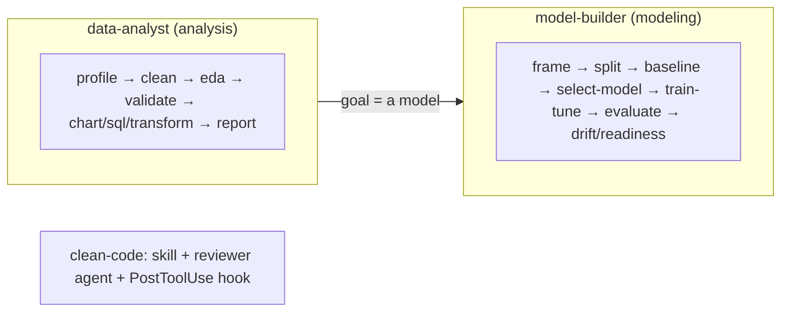

# CLAUDE.md — claude-all-in-one-plugin

A Claude Code **plugin**: conductor *agents* drive *skills* (bundled Python scripts + `SKILL.md`) across two end-to-end pipelines — **data analysis** and **tabular ML modeling** — plus a reactive **code-quality** layer. See [README.md](README.md) for the full catalog.

## Layout
- `skills/<name>/SKILL.md` (+ optional `scripts/*.py`) — one bounded capability each. **17 slash-skills** (each has a `SKILL.md`); `skills/verify-analysis/` is an 18th dir that ships only a bundled `stat_tests.py` (no `SKILL.md`, driven by the `verify-analysis` agent).
- `agents/<name>.md` — conductor/specialist subagents. 6 agents.
- `hooks/hooks.json` + `hooks/clean-code-reminder.py` — one PostToolUse hook (clean-code nudge on source edits).
- `.claude-plugin/{plugin.json,marketplace.json}` — plugin + marketplace manifests.

## Conventions when adding / editing a skill
- **`SKILL.md` frontmatter:** `name`, `description` (rich, ending with a "Use when …" trigger), `allowed-tools`.
- **Body:** `When to use` · `Contract` (hard rules) · `Steps` · `Output style` · `Grounding` (cite the sources behind any methodology claim).
- **Scripts are self-contained.** Helpers (`load`, `find_split`, `infer_task`, `build_preprocessor`, `clf_metrics`/`reg_metrics`, `fmt`) are **copied byte-identical** across scripts, never imported across skill folders — keep them in sync (a comment says so).
- **Every generated report OPENS with `## At a glance` + a Mermaid block** (hard rule — the maintainer is a visual learner).
- **Emit a machine-readable sidecar** next to any human report (e.g. `baseline_metric.json`, `split_summary.json`, `drift_summary.json`, `tuned_metric.json`) so downstream skills/agents parse JSON, never scrape prose.
- **Composition contract:** predictions files use columns `y_true, y_pred[, y_score]` + feature columns, primary metric `f1_macro` (classification) / `mae` (regression), so `baseline`/`train-tune` output feeds `evaluate-model`/`check-drift` unchanged.
- **Be bounded and honest.** Each skill scopes out and plainly refuses what it can't do (e.g. `evaluate-model`/`check-drift` state they cannot measure online performance or concept drift without labels). Never present offline metrics as production/business performance.
- **Modeling discipline (sacred):** preprocessing fit on **train only** (inside the CV pipeline); the **test split is touched once**, at the very end; baseline before complexity.

## Conventions when adding / editing an agent
- Frontmatter uses `tools:` (not `allowed-tools`) + a `description` with a "Use when" trigger.
- Agents are **conductors**: a subagent can't spawn subagents, so inline each skill's steps and defer to the `SKILL.md` for detail. **Stop at human-decision checkpoints.** Never modify source data.

## Python environment
Use the project venv for all script steps: `.venv/bin/python`. Create once if missing:
`python3 -m venv .venv && .venv/bin/pip install -q pandas numpy scikit-learn scipy openpyxl pyarrow matplotlib duckdb`
(`readiness_check.py` and `cleaning-report/report.py` are stdlib-only.)

## Don't commit
`.gitignore` excludes `data/` (test datasets), `.venv/`, `.claude/` (local Claude state), `__pycache__/`, and generated artifacts (`*_splits/`, `problem_framing_brief.md`, `*_clean.*`). Source data is never modified by any skill.

## How this codebase is extended (recommended)
New skills/agents here are built **research → design → adversarial-verify → implement → code-review → fix**: ground methodology claims in cited sources, draft a spec, have independent agents red-team it, then verify the implementation against the real files before trusting it. This caught real bugs every round (leakage, small-sample PSI inflation, false-PASS audits) — keep the loop.
