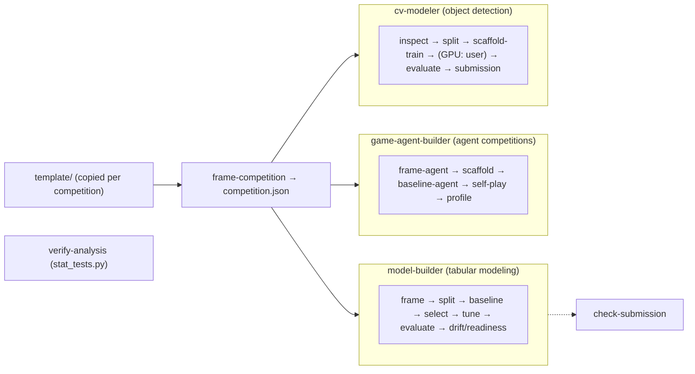

# CLAUDE.md — claude-research-template

Claude Code skills, agents and a per-competition template for **AI competitions** (Kaggle and other platforms). This file governs *developing* the repo; `template/CLAUDE.md` governs *each competition* and is what gets copied. Conductor *agents* drive *skills* (bundled Python scripts + `SKILL.md`) across three end-to-end pipelines — **tabular ML modeling**, **game / agent competitions** and **object-detection computer vision** — plus a statistical validator (`verify-analysis`). See [README.md](README.md) for the full catalog.

## Layout
- `skills/<name>/SKILL.md` (+ optional `scripts/*.py`) — one bounded capability each. **20 slash-skills** (each has a `SKILL.md`); `skills/verify-analysis/` is a 21st dir that ships only a bundled `stat_tests.py` (no `SKILL.md`, driven by the `verify-analysis` agent).
- `agents/<name>.md` — conductor/specialist subagents. 4 agents.
- `template/` — the per-competition folder copied by `new_competition.sh`: `CLAUDE.md` (the competition rules Claude follows), `competition.json` (all `null` until `frame-competition` fills it), `experiments/log.csv`, `data/`, `submissions/`, `src/`.
- `install.sh` — symlinks `skills/*` into `~/.claude/skills/`, copies `agents/*.md` into `~/.claude/agents/` (no plugin manifest: this is user-level install). `new_competition.sh` — copies `template/` and starts a git repository.
- **Script paths:** a `SKILL.md` calls its own scripts as `${CLAUDE_SKILL_DIR}/scripts/…`; an agent calls a skill's script as `$HOME/.claude/skills/<skill>/scripts/…` (agents have no skill directory). Never `${CLAUDE_PLUGIN_ROOT}` — there is no plugin.
- **Competition rules belong in `template/CLAUDE.md`**, not here; a rule that every competition must follow and that a script can check belongs in a skill's script as well.

## Conventions when adding / editing a skill
- **`SKILL.md` frontmatter:** `name`, `description` (rich, ending with a "Use when …" trigger), `allowed-tools`.
- **Body:** `When to use` · `Contract` (hard rules) · `Steps` · `Output style` · `Grounding` (cite the sources behind any methodology claim).
- **Scripts are self-contained.** Cross-script helpers are **copied byte-identical**, never imported across skill folders, and `tests/check_helpers_synced.py` **enforces** it (run it after touching any copied helper — it is the source of truth for the groups). Current groups: modeling (`load`, `find_split`, `infer_task`, `build_preprocessor`, `clf_metrics`/`reg_metrics`, `enforce_test_lock`, `fmt`); game-agent (`agent_count`, `outcome`, a simpler `{:.3f}` `fmt`); cv-modeler (`stem_of`, `is_leaky_provenance`); and the shared utilities (`die`, `eprint`).
- **Every generated report OPENS with `## At a glance` + a Mermaid block** (hard rule — the maintainer is a visual learner).
- **Emit a machine-readable sidecar** next to any human report (e.g. `baseline_metric.json`, `split_summary.json`, `drift_summary.json`, `tuned_metric.json`) so downstream skills/agents parse JSON, never scrape prose.
- **Composition contract:** predictions files use columns `y_true, y_pred[, y_score]` + feature columns, primary metric `f1_macro` (classification) / `mae` (regression), so `baseline`/`train-tune` output feeds `evaluate-model`/`check-drift` unchanged.
- **Be bounded and honest.** Each skill scopes out and plainly refuses what it can't do (e.g. `evaluate-model`/`check-drift` state they cannot measure online performance or concept drift without labels). Never present offline metrics as production/business performance.
- **Modeling discipline (sacred):** preprocessing fit on **train only** (inside the CV pipeline); the **test split is touched once**, at the very end; baseline before complexity.
- **Game-agent pipeline scaffolds — it doesn't train or serve.** The game-agent skills **scaffold · evaluate · profile**; they do NOT train deep-RL agents (GPU-hours — defer to SB3/CleanRL) or run the live ladder. The runtime is `kaggle_environments` (env id discovered from the comp, never hardcoded — Pokemon TCG's env is `cabt`, not `pokemon_tcg`; its engine is a Linux binary that won't run on macOS). Honesty boundary, like the modeling one: a local self-play rating ≠ leaderboard standing. Start scripted before RL (scripted bots often beat RL under comp time limits); the generated bundle must never crash / always return a legal move (a specific first-legal fallback) / honor a cumulative time budget.
- **The CV pipeline scaffolds too — it doesn't train the model.** `cv-modeler` (object detection) **scaffolds · evaluates · formats submissions**; it generates a runnable Ultralytics YOLO transfer-learning bundle + a CPU smoke test, but the real GPU training is the **user's** (Ultralytics/MMDetection both say CPU training is too slow). Same honesty boundary: an offline **mAP ≠ leaderboard ≠ deployable operating point**. The **sacred leakage rule ports to images**: `split-images` groups by SOURCE (never a per-image random split when a group exists), **consumes `inspect-images`' augmentation-aware near-dup clusters** so rotated/near-identical copies can't straddle folds, and its real check is `dup_clusters_straddling_folds==0` (the `groups_straddling==0` check is tautological — GroupKFold never straddles the key you give it). A per-image split is **refused** unless explicitly acked, then stamped `per-image-ACKED-leaky` and propagated so `evaluate-detection` marks the mAP inflated. 16-bit imagery is normalized **per-image** to 8-bit (never silently truncated, never dataset-global stats = leak); COCO category ids are remapped to **0-based contiguous** via one shared `class_map.json` consumed by train/eval/submission (never the naive `id-1`); YOLO box coords come from `boxes.xyxy` (top-left), never the center-based `boxes.xywh`. **Vision-model security / machine-unlearning is OUT OF SCOPE** (a poisoned-model sub-task is unresearched — never scaffold it, not even ad hoc).

## Conventions when adding / editing an agent
- Frontmatter uses `tools:` (not `allowed-tools`) + a `description` with a "Use when" trigger.
- Agents are **conductors**: a subagent can't spawn subagents, so inline each skill's steps and defer to the `SKILL.md` for detail. **Stop at human-decision checkpoints.** Never modify source data. (`model-builder` stays tabular and refuses RL/agents/images → agent work routes to `game-agent-builder`, image work to `cv-modeler`.)

## Python environment
Use the project venv for all script steps: `.venv/bin/python`. Create once if missing:
`python3 -m venv .venv && .venv/bin/pip install -q pandas numpy scikit-learn scipy openpyxl pyarrow`
(`readiness_check.py` is stdlib-only.) The **game-agent** scripts need `kaggle-environments` to run episodes (else they exit 2 with an install hint; the submission bundle still generates without it); `trueskill` is optional (else stdlib ELO). The **cv-modeler** scripts need `pillow` for image inspection/conversion; `ultralytics` (CPU smoke-train), `astropy` (FITS), and `pycocotools` (exact COCO mAP) are optional, each exiting 2 with a hint when absent (the bundle/report still generates).

## Don't commit
`.gitignore` excludes `data/` (test datasets), `.venv/`, `.claude/` (local Claude state), `__pycache__/`, generated modeling artifacts (`*_splits/`, `problem_framing_brief.md`), the game-agent artifacts (`*_submission/`, `submission*.tar.gz`, `agent_task.json`, `*_ladder*`, …), and the cv-modeler artifacts (`image_inspection*`, `image_splits/`, `cv_train_scaffold/`, `smoke_throwaway/`, `class_map.json`, `detection_metrics*`, `preds*.csv`, `submission.csv`, …). Source data is never modified by any skill.

## How this codebase is extended (recommended)
New skills/agents here are built **research → design → adversarial-verify → implement → code-review → fix**: ground methodology claims in cited sources, draft a spec, have independent agents red-team it, then verify the implementation against the real files before trusting it. This caught real bugs every round (leakage, small-sample PSI inflation, false-PASS audits) — keep the loop.
