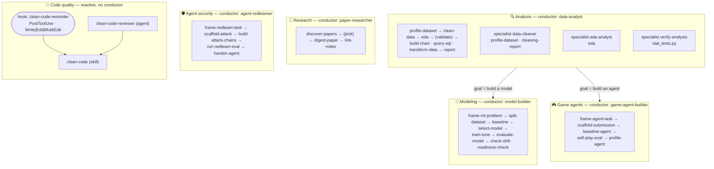

# claude-all-in-one-plugin

An all-in-one Claude Code plugin. Five end-to-end pipelines — **data analysis**, **tabular ML modeling**, **paper-reading research**, **Kaggle agent-competition building**, and **authorized agent-security red-teaming** — plus a **code-quality** layer, organized as *conductor agents* that drive *skills* stage-by-stage and stop at human-decision checkpoints.

## Architecture

Each **agent** is a conductor that owns a lifecycle and drives the **skills** it needs (a subagent can't spawn subagents, so it inlines each skill's steps and defers to the skill for detail). The two pipelines connect: when analysis concludes the goal is a model, `data-analyst` hands off to `model-builder`.



## Agents → the skills they own

A conductor *owns a lifecycle*; a specialist *owns a stage*. Skills are reusable, so several agents share the early data skills — "owns" means the agent that primarily orchestrates it.

| Agent | Kind | Drives |
|-------|------|--------|
| `model-builder` | conductor — **modeling** | `frame-ml-problem` · `split-dataset` · `baseline` · `select-model` · `train-tune` · `evaluate-model` · `check-drift` · `readiness-check` |
| `data-analyst` | conductor — **analysis** | `profile-dataset` · `clean-data` · `eda` · `build-chart` · `query-sql` · `transform-data` · `report` · `cleaning-report` (delegates validation to `verify-analysis`, modeling to `model-builder`) |
| `paper-researcher` | conductor — **research / paper-reading** | `discover-papers` · `digest-paper` · `link-notes` (finds Q1/high-impact papers, reads deeply, judges relevance, answers questions with web fallback, files linked notes + recall) |
| `game-agent-builder` | conductor — **game agents** | `frame-agent-task` · `scaffold-submission` · `baseline-agent` · `self-play-eval` · `profile-agent` (scaffolds + evaluates Kaggle "submit-an-agent" bots; starts scripted, does **not** train RL) |
| `agent-redteamer` | conductor — **agent security** | `frame-redteam-task` · `scaffold-attack` · `build-attack-chains` · `run-redteam-eval` · `harden-agent` (authorized, sandbox-only red-team **and** harden of tool-using agents) |
| `data-cleaner` | specialist — iterative cleaning loop | `profile-dataset` · `cleaning-report` (does the cleaning itself per `clean-data`'s approach, via generated per-round scripts) |
| `eda-analyst` | specialist — exploratory analysis | `eda` |
| `verify-analysis` | specialist — statistical validation | bundled `stat_tests.py` (corr / group / anova / chi2; no slash-skill) |
| `clean-code-reviewer` | reactive — audits a diff/files | `clean-code` |

Every conductor **stops at checkpoints** (the human keeps the judgment calls), **never modifies source data** (every stage writes new files), and opens its reports with a Mermaid diagram. `model-builder` additionally enforces the modeling disciplines: leakage-safe (preprocessing fit on train only; test touched once at the end), baseline-before-complexity, and **offline ≠ online** (it says what it cannot measure). Tabular only — it refuses DL/RL, handing agent goals to `game-agent-builder`. The two agentic conductors carry the same honesty: they **scaffold/evaluate/profile/harness but do not train deep-RL or run the live ladder** — a local self-play rating ≠ Kaggle standing, an offline ASR ≠ production security. `agent-redteamer` is additionally **dual-use-bounded**: a one-time authorization gate, per-skill refusals (sandbox/competition/owned systems only — never production targets, named products, or other competitors), predicate-locked attacks, and judge-free metrics.

## Skills reference

**Modeling** (the `model-builder` pipeline; each writes a Mermaid-led report + a machine-readable sidecar JSON):

| Skill | What it does |
|-------|--------------|
| `frame-ml-problem` | Business goal → well-posed ML problem; separates ideal outcome from the model's goal, gates on whether ML is even needed, defines business success vs. technical metrics. Writes a Problem Framing Brief. |
| `split-dataset` | Train/val/test the **leakage-safe** way (random+stratified · group/entity-aware · temporal); verifies no row/entity leaks. Writes `split_report.md` + `split_summary.json`. |
| `baseline` | The **number to beat** — Dummy floor + one simple model, scored on val. Writes `baseline_report.md`, a predictions file, and `baseline_metric.json`. |
| `select-model` | **Advisory** — fingerprints the data and recommends a model family (classic ML vs DL, flags RL), bounded by the baseline number + interpretability/latency vetoes. Writes `model_recommendation.md`. |
| `train-tune` | Leakage-safe `RandomizedSearchCV` (preprocessor inside the CV pipeline, CV on train only), logs every run to `experiments.jsonl`, emits predictions in `evaluate-model`'s schema. Refuses DL/GPU/RL. |
| `evaluate-model` | Evaluates a **predictions file** (framework-agnostic) — metrics, confusion matrix / residuals, **slice-based error analysis**. Flags what offline eval can't measure. |
| `check-drift` | **Population drift** between two snapshots — per-feature PSI + TVD/optional KS, plus target P(y) & prediction P(y_pred) drift. Offline & label-free; refuses concept drift without labels. Writes `drift_report.md`. |
| `readiness-check` | **Pre-deploy audit** against an ML Test Score–style checklist (leakage-safe split, beaten baseline, recorded tuning, reproducibility, role-aware test-holdout). Read-only, pure stdlib. Writes `readiness_report.md`. |

**Analysis** (the `data-analyst` pipeline):

| Skill | What it does |
|-------|--------------|
| `profile-dataset` | **Read-only** profiling — shape, types, missingness, duplicates, outliers, quality warnings. Run first on any new dataset. |
| `clean-data` | Fixes data-quality issues by proposing a plan, generating + running a script, and writing a **new** cleaned file + change log. |
| `eda` | Exploratory analysis on a **clean** file → an executed Jupyter notebook (distributions, correlations, segments). |
| `transform-data` | Reshape clean data — groupby/aggregate, pivot/melt, joins, derived columns. |
| `query-sql` | Answer a question by writing SQL over a CSV/Parquet/JSON file with DuckDB (no server). |
| `build-chart` | One presentation-quality chart (PNG) — bar, line, hist, scatter, box. |
| `cleaning-report` | Render a cleaning run log (`cleaning_run.json`) into a Mermaid-diagram Markdown report. |
| `report` | Assemble the final `report.md` from **validated** findings (with verdicts). |

**Research** (the `paper-researcher` pipeline — a weekly paper-reading habit):

| Skill | What it does |
|-------|--------------|
| `discover-papers` | **DISCOVER** — keyword → ranked shortlist of **Q1-journal or high-impact** papers via the free OpenAlex API; true-Q1 labels when you supply a Scimago table, else impact-only (citations/year), and it says which. Writes a Mermaid-led shortlist + JSON sidecar. |
| `digest-paper` | **DIGEST** — reads one paper with Keshav's **three-pass method**, scaffolds a structured literature note (core claim · method · results · limitations · relevance-to-your-work) with bibliographic fields pre-filled, and authors a **self-contained HTML mechanism explainer** (for visual learners) + active-recall prompts. |
| `link-notes` | **RETAIN & CONNECT** — builds a Map-of-Content `index.md` (Mermaid knowledge graph from `[[wikilinks]]`, Foam/Obsidian style) and runs a **spaced active-recall scheduler** over each note's prompts (because linked notes alone ≠ retention; retrieval practice is). |

**Game agents** (the `game-agent-builder` pipeline — Kaggle "submit-an-agent" simulation competitions like Pokemon TCG AI Battle / Orbit Wars / ConnectX; each writes a Mermaid-led report + a JSON sidecar). It **scaffolds/evaluates/profiles — it does not train deep-RL** (defers to SB3/CleanRL) or run the live ladder:

| Skill | What it does |
|-------|--------------|
| `frame-agent-task` | Reads the competition's **real** interface (obs/action shape, legal-move format, the cumulative time budget + overage, daily submission cap, skill-rating scoring) from its rules/starter code — no hardcoded env ids (Pokemon TCG's env is `cabt`, not `pokemon_tcg`) — and runs the "start scripted, not RL" gate. Writes `agent_task_brief.md` + `agent_task.json`. |
| `scaffold-submission` | Generates a submittable bundle (`main.py` at the root of `submission.tar.gz`) with a **never-crash legal fallback** (returns a specific first-legal move) + a cumulative **time guard**, smoke-tested locally via `kaggle_environments`. The immediately-submittable "does it run" floor. |
| `baseline-agent` | Measures a scripted/heuristic policy vs a simple opponent — the **number to beat** — with a crash/timeout/illegal **health gate**. Scripted-before-RL, because scripted bots often beat RL under competition time limits. |
| `self-play-eval` | A **local** self-play ELO/TrueSkill ladder over your pool (bot, prior versions, baselines) so you iterate before burning daily submissions. Leads with **offline rating ≠ Kaggle standing**. |
| `profile-agent` | Win-rate by opponent, invalid-move rate, and prioritized next-step **hypotheses** (fix legality / iterate / search / consider RL — with framework pointers). The agent analog of slice-based error analysis. |

**Agent security** (the `agent-redteamer` pipeline — authorized, **sandbox-only** red-teaming **and** hardening of tool-using LLM agents, e.g. the Kaggle "AI Agent Security: Multi-Step Tool Attacks" comp; metrics are judge-free deterministic predicates):

| Skill | What it does |
|-------|--------------|
| `frame-redteam-task` | The **authorization gate** + framing: confirms the target is a competition sandbox / owned system (refuses production, named products, other competitors), pins the `benign`/`targeted_unsafe` predicates, the metrics (Benign Utility · Utility-Under-Attack · Targeted ASR) and the replay-determinism rule. Writes `redteam_brief.md` + `redteam_task.json`. |
| `scaffold-attack` | Emits the `attack.py` adapter (a shim to the comp's `AttackAlgorithm`, confirmed from its starter code) + a `target_adapter.py` stub — **interface, not exploit content**. Authorized targets only. |
| `build-attack-chains` | **Predicate-locked** multi-step prompt-injection chains for the one declared unsafe action (harmless-in-isolation, harmful-when-chained). Refuses open-ended jailbreaks / production / other competitors. |
| `run-redteam-eval` | Replays the chains and computes **Benign Utility · Utility-Under-Attack · Targeted ASR** via deterministic state predicates (**never an LLM judge** — it can itself be hijacked), with a determinism check. Ships a mock target so it runs end-to-end. Leads with **offline ASR ≠ production security**. |
| `harden-agent` | Recommends mitigations by intervention stage (text/model/execution-level) and emits a defended target so you re-measure **residual ASR** on the same chains — closing the find→fix loop. |

**Code quality:**

| Skill | What it does |
|-------|--------------|
| `clean-code` | Recall + apply the pragmatic, language-agnostic "Part 7" clean-code ruleset when writing/refactoring code. Invoke `/clean-code` for the full ruleset with each rule's trade-off. |

## Hooks

The plugin ships **one** hook (declared in [`hooks/hooks.json`](hooks/hooks.json)):

| Hook | Event · matcher | What it does |
|------|-----------------|--------------|
| **clean-code reminder** | `PostToolUse` · `Write\|Edit\|MultiEdit` | After a **source-code** file is written/edited, injects the compact "Part 7" clean-code checklist into context so the rules stay top-of-mind. Filters by extension — config/docs/data (`.md`, `.csv`, `.json`, …) stay silent. **Fails safe**: any error → silent exit, never disrupts the edit. Script: [`hooks/clean-code-reminder.py`](hooks/clean-code-reminder.py). |

It's the lightweight third layer of the code-quality trio: a short nudge on every code edit (**hook**), the full ruleset one `/clean-code` call away (**skill**), and a deeper audit from the `clean-code-reviewer` (**agent**).

> **Activation:** the hook ships with the plugin and fires once the plugin is installed. The author also keeps a machine-wide copy under `~/.claude/` (the hook in `~/.claude/settings.json` → `PostToolUse`) so it runs in **every** repo without installing the plugin. Running both at once in the same repo fires the reminder twice — keep only one source.

## Weekly cadence (optional) — automating DISCOVER

The research pipeline is **on-demand** by default (you run `paper-researcher` / `discover-papers` when you want). To make the *discovery* half a true weekly habit, drive it with a **Claude Code Cloud Routine** — it runs on Anthropic-managed cloud infrastructure, so it fires on schedule **even with your laptop closed**, and the cloud session can run the committed skills.

- **What to schedule:** a weekly prompt like *"Run `discover-papers` for each keyword in `research/interests.json`, commit the shortlists, and open `research/recall.md` listing what's due for review."*
- **Hard requirement — commit what it needs:** a Cloud Routine only sees what is committed to the repo's **default branch**. Commit `research/interests.json` (and the plugin's skills) — locally-installed-only skills and un-committed config are invisible to the cloud clone.
- **Caveats (research preview):** Routines need a Pro/Max/Team/Enterprise plan with Claude Code on web; they have a 1-hour minimum interval and a daily run cap, and the API surface may change. If you can't use them, fall back to a Desktop scheduled task (needs the machine on) or a plain `cron` job invoking `discover.py`.
- **DIGEST/RETAIN stay human-in-the-loop:** discovery can be automated, but reading the paper and writing the note from understanding is what builds retention — don't automate that away.

## Install

```
/plugin marketplace add Alice-creator/claude-all-in-one-plugin
/plugin install claude-all-in-one-plugin@claude-all-in-one
```

For local development from a clone (point at the clone's absolute path, then install):

```
/plugin marketplace add /path/to/claude-all-in-one-plugin
/plugin install claude-all-in-one-plugin@claude-all-in-one
```

Plugins install at the user level — once installed, the skills and agents are available in **every** repo (restart Claude Code so they register). The GitHub install reads the repo's default branch, so push/merge to `main` before using it.

## Requirements

The data skills use Python with `pandas` (plus `openpyxl` for Excel, `pyarrow` for Parquet); EDA also uses `matplotlib` and the notebook stack, and `query-sql` uses `duckdb`. Among the modeling skills, `split-dataset` · `baseline` · `train-tune` · `evaluate-model` need `scikit-learn`; `train-tune` and `check-drift` (optional KS test only) use `scipy`; `select-model` needs only pandas/numpy and `readiness-check` is pure stdlib. The **game-agent** skills need `kaggle-environments` to run episodes (the submission bundle still generates without it; `trueskill` is optional, else stdlib ELO); the **agent-security** harness is pure stdlib with a built-in mock target (a real target / `agentdojo` / `injecagent` is user-supplied). The single install covers the data + modeling stack:

```
pip install pandas numpy scikit-learn scipy openpyxl pyarrow matplotlib duckdb
# for the game-agent pipeline (running episodes / the local ladder):
pip install kaggle-environments   # optional: trueskill
```

## Roadmap

- **Analysis** ✅, **tabular modeling** ✅, **research** ✅, **game agents** ✅, and **agent security** ✅ pipelines are in place, end-to-end.
- **Live MLOps:** real (online) monitoring, drift alerting, and retraining triggers are intentionally **out of scope** for the offline tooling — `check-drift` / `readiness-check` are the honest offline stand-ins (they say what they cannot measure).
- **Deep-RL training** for the game-agent pipeline is intentionally **out of scope** (GPU-hours, not a skill's job) — the pipeline scaffolds/evaluates/profiles and points at SB3/CleanRL for the training itself.
- **MCP:** a SQL / database connector is a natural next addition.
