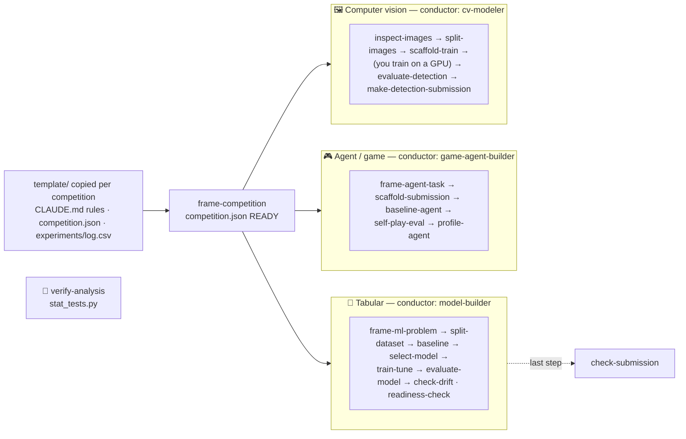

# claude-research-template

Claude Code skills, agents and a per-competition template for **AI competitions**: Kaggle and other platforms. Install the skills once, then copy the template for each new competition: its `CLAUDE.md` gives Claude the competition rules to follow from the first session. Three end-to-end pipelines, **leakage-safe tabular ML modeling**, **game / agent competitions** and **leakage-safe object-detection computer vision**, plus a statistical validator. Each pipeline is a *conductor agent* that drives *skills* stage by stage and stops at human-decision checkpoints. The rules that matter (test-split lock, near-duplicate-aware image splits, an agent bundle that never crashes and always returns a legal move) are enforced in code, not prose.

## Architecture

Each **agent** is a conductor that owns a lifecycle and drives the **skills** it needs (a subagent can't spawn subagents, so it inlines each skill's steps and defers to the skill for detail). `frame-competition` routes by `competition.json` track: `tabular` → `model-builder`, `game-agent` → `game-agent-builder`, `cv-detection` → `cv-modeler`.



## Agents → the skills they own

| Agent | Kind | Drives |
|-------|------|--------|
| `model-builder` | conductor — **modeling** | `frame-ml-problem` · `split-dataset` · `baseline` · `select-model` · `train-tune` · `evaluate-model` · `check-drift` · `readiness-check` |
| `game-agent-builder` | conductor — **game agents** | `frame-agent-task` · `scaffold-submission` · `baseline-agent` · `self-play-eval` · `profile-agent` (scaffolds + evaluates Kaggle "submit-an-agent" bots; starts scripted, does **not** train RL) |
| `cv-modeler` | conductor — **computer vision (object detection)** | `inspect-images` · `split-images` · `scaffold-train` · `evaluate-detection` · `make-detection-submission` (scaffolds a leakage-safe, transfer-learning YOLO detection pipeline; does **not** train the model — that's GPU-hours you run — and does **not** do vision-model security / machine-unlearning) |
| `verify-analysis` | specialist — statistical validation | bundled `stat_tests.py` (corr / group / anova / chi2; no slash-skill) |

Every conductor **stops at checkpoints**, **never modifies source data** (every stage writes new files) and opens its reports with a Mermaid diagram. All three pipelines hold the same honesty boundary: an offline metric ≠ leaderboard standing ≠ production. `game-agent-builder` and `cv-modeler` **scaffold but do not train** the expensive part: deep-RL and GPU training are yours.

## Skills reference

**Competition** (platform-agnostic, used by every track):

| Skill | What it does |
|-------|--------------|
| `frame-competition` | Fills `competition.json` from the platform's own pages (metric + direction, deadlines, external-data / pretrained-model rules, submission limits, code-competition runtime/internet, public-leaderboard fraction) and a validation scheme that mirrors the test split. Unknowns stay `null` as open questions. `check_competition.py` exits 1 until the required facts are known. Writes `competition_brief.md` + `competition_check.json`. |
| `check-submission` | Validates a tabular submission CSV against the platform's sample/format file: columns and order, row count, missing / extra / duplicated ids, empty/NaN cells, text in numeric columns, constant columns. Format only. Writes `submission_check.json`. |

**Modeling** (the `model-builder` pipeline; each writes a Mermaid-led report + a machine-readable sidecar JSON):

| Skill | What it does |
|-------|--------------|
| `frame-ml-problem` | Business goal → well-posed ML problem; separates ideal outcome from the model's goal, gates on whether ML is even needed, defines business success vs. technical metrics. Writes a Problem Framing Brief. |
| `split-dataset` | Train/val/test the **leakage-safe** way (random+stratified · group/entity-aware · temporal); verifies no row/entity leaks. Writes `split_report.md` + `split_summary.json`. |
| `baseline` | The **number to beat** — Dummy floor + one simple model, scored on val. Writes `baseline_report.md`, a predictions file, and `baseline_metric.json`. |
| `select-model` | **Advisory** — fingerprints the data and recommends a model family (classic ML vs DL, flags RL), bounded by the baseline number + interpretability/latency vetoes. Writes `model_recommendation.md`. |
| `train-tune` | Leakage-safe `RandomizedSearchCV` (preprocessor inside the CV pipeline, CV on train only), logs every run to `experiments.jsonl`, emits predictions in `evaluate-model`'s schema. Refuses DL/GPU/RL. |
| `evaluate-model` | Evaluates a **predictions file** (framework-agnostic) — metrics, confusion matrix / residuals, **slice-based error analysis**. Flags what offline eval can't measure. |
| `check-drift` | **Population drift** between two snapshots — per-feature PSI + TVD/optional KS, plus target P(y) & prediction P(y_pred) drift. Offline & label-free; refuses concept drift without labels. Writes `drift_report.md`. |
| `readiness-check` | **Pre-deploy audit** against an ML Test Score–style checklist (leakage-safe split, beaten baseline, recorded tuning, reproducibility, role-aware test-holdout). Read-only, pure stdlib. Writes `readiness_report.md`. |

**Game agents** (the `game-agent-builder` pipeline — Kaggle "submit-an-agent" simulation competitions like Pokemon TCG AI Battle / Orbit Wars / ConnectX; each writes a Mermaid-led report + a JSON sidecar). It **scaffolds/evaluates/profiles — it does not train deep-RL** (defers to SB3/CleanRL) or run the live ladder:

| Skill | What it does |
|-------|--------------|
| `frame-agent-task` | Reads the competition's **real** interface (obs/action shape, legal-move format, the cumulative time budget + overage, daily submission cap, skill-rating scoring) from its rules/starter code — no hardcoded env ids (Pokemon TCG's env is `cabt`, not `pokemon_tcg`) — and runs the "start scripted, not RL" gate. Writes `agent_task_brief.md` + `agent_task.json`. |
| `scaffold-submission` | Generates a submittable bundle (`main.py` at the root of `submission.tar.gz`) with a **never-crash legal fallback** (returns a specific first-legal move) + a cumulative **time guard**, smoke-tested locally via `kaggle_environments`. The immediately-submittable "does it run" floor. |
| `baseline-agent` | Measures a scripted/heuristic policy vs a simple opponent — the **number to beat** — with a crash/timeout/illegal **health gate**. Scripted-before-RL, because scripted bots often beat RL under competition time limits. |
| `self-play-eval` | A **local** self-play ELO/TrueSkill ladder over your pool (bot, prior versions, baselines) so you iterate before burning daily submissions. Leads with **offline rating ≠ Kaggle standing**. |
| `profile-agent` | Win-rate by opponent, invalid-move rate, and prioritized next-step **hypotheses** (fix legality / iterate / search / consider RL — with framework pointers). The agent analog of slice-based error analysis. |

**Computer vision** (the `cv-modeler` pipeline — object detection on images, e.g. astronomical debris-streak detection; each writes a Mermaid-led report + a JSON sidecar). It **scaffolds/evaluates — it does not train the model** (that's GPU-hours you run on your own hardware) and does **not** touch vision-model security / machine-unlearning:

| Skill | What it does |
|-------|--------------|
| `inspect-images` | "Become one with the data" — detects **16-bit** astronomical PNGs a naive 8-bit loader would truncate, finds **augmentation-aware near-duplicates** (canonical dHash over rot/flip orientations) with an explicit reliability flag for sparse-sky imagery, summarizes COCO annotations, and proposes provenance **group-key candidates**. Writes `image_inspection.json`. |
| `split-images` | **Leakage-safe** grouped split (GroupKFold / grouped holdout) that **consumes** inspect-images' near-dup clusters so rotated/near-identical copies can't straddle folds, and **refuses a silent per-image split** (no filename group ≠ independence). Its real check is `dup_clusters_straddling_folds==0`, not the tautological `groups_straddling==0`. Writes `image_splits/` + `split_summary.json`. |
| `scaffold-train` | Generates a **runnable Ultralytics YOLO** transfer-learning bundle (data.yaml, `prepare_data.py`, `train.py`, `predict.py`, pinned requirements) with a COCO→0-based **class map** shared downstream and **per-image** 16-bit→8-bit normalization. Runs a CPU **smoke test** that asserts YOLO loaded >0 labels. Manifest carries `produces_trained_model:false` — real training is your GPU. |
| `evaluate-detection` | Honest offline **mAP / per-class AP** — prefers **pycocotools**, with a clearly-labeled approximate numpy fallback (global per-class accumulation). Reads split provenance and **stamps a leaky/unknown split's mAP as inflated**; reports boxes/image + min confidence so the COCO top-100 and low-threshold caveats are data-driven. Sidecar: `offline_only`, `matches_leaderboard:false`. |
| `make-detection-submission` | Formats predictions into the competition's submission (`conf x y w h` per-image strings aligned to `sample_submission`, or COCO `results.json`) and validates the **format** (every sample image present, columns/tokens well-formed). Validates format **not correctness**; refuses to guess the box order/units; warns on empty/sparse output. |

## Install

```
git clone git@github.com:Alice-creator/claude-research-template.git
cd claude-research-template
./install.sh             # symlinks skills into ~/.claude/skills, copies agents into ~/.claude/agents
```

Restart Claude Code afterwards. Skills are symlinked, so a `git pull` updates every competition at once. Agents are copied (symlinked agents are not documented as supported), so re-run `./install.sh` after pulling. `./install.sh --uninstall` removes only what it installed; it never overwrites a skill or agent of the same name that it did not install.

## Start a competition

```
./new_competition.sh ~/competitions/<name>
cd ~/competitions/<name> && claude
```

The new folder gets the template (`CLAUDE.md` rules, `competition.json`, `data/raw|external|processed/`, `experiments/log.csv`, `submissions/`, `src/`) and its own git repository. In the first session, Claude reads `CLAUDE.md` and runs `frame-competition`.

## Requirements

The modeling skills need `pandas`, `numpy` and `scikit-learn`; `train-tune` and `check-drift` (optional KS test only) use `scipy`; `readiness-check` is pure stdlib. The **game-agent** skills need `kaggle-environments` to run episodes (the submission bundle still generates without it; `trueskill` is optional, else stdlib ELO). The **cv-modeler** skills need `pillow`; `ultralytics` (CPU smoke-train), `astropy` (FITS) and `pycocotools` (exact COCO mAP) are optional.

```
pip install pandas numpy scikit-learn scipy openpyxl pyarrow
pip install kaggle-environments   # game-agent pipeline; optional: trueskill
pip install pillow                # cv-modeler pipeline; optional: ultralytics, astropy, pycocotools
```

## Tests

```
python3 tests/check_helpers_synced.py   # copied helpers stay byte-identical
```

## Roadmap

- **More tracks**: NLP / LLM fine-tuning and time-series competitions have no pipeline yet (`track: other`).
- **Deep-model training** (deep-RL for game agents; the GPU fit for `cv-modeler`) is out of scope: the pipelines scaffold/evaluate and point at the real training tools (SB3/CleanRL; Ultralytics on your GPU).
- **CV task coverage:** detection first; image **classification** and **segmentation** (Dice/IoU) are natural next additions to `cv-modeler`.
