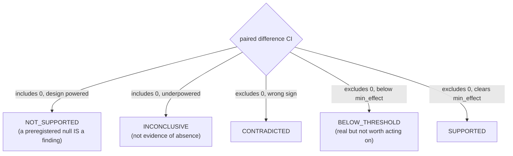

# analyze-trials

Compute what the numbers are **allowed** to claim. Never a point estimate: when few runs are affordable, conclusions drawn from point estimates differ substantially from conclusions drawn after statistical analysis.

## When to use
- Once `trials.jsonl` exists (from the scaffolded runner, or any file matching that schema).
- When comparing two or more agent configurations and someone is about to say "X is better than Y".
- NOT for deciding *why* it fails (that is `diagnose-failures`) and NOT for tabular model metrics (`evaluate-model`).

## Contract (important)
- **Resample tasks, never runs.** N tasks × K runs are not N·K independent observations; runs of one task are correlated. Resampling runs gives a visibly narrower — and false — interval.
- **Bootstrap, not a normal approximation.** Success rates are bounded in [0,1] and often near a boundary, where the Gaussian interval misleads.
- **Prefer the paired difference.** Same tasks, both arms, analyse the difference — it removes task-difficulty variance for free.
- **Report cost beside accuracy, always.** Accuracy is purchasable: calling a stochastic model more times raises it. A gain without its cost is not a result.
- **Refuses on prereg-hash mismatch.** If the rows were stamped with a different hypothesis than `prereg.json` now holds, the confirmatory claim is refused outright.
- **Six verdicts, deliberately.** "Not significant" and "no effect" are different claims, and an underpowered null is INCONCLUSIVE, not negative.
- **Refuses rather than warns** on: a missing or non-PASS validity gate, any unstamped trial row, a non-bool `success`, or fewer than **30** shared tasks. `--exploratory` downgrades these to warnings and stamps `confirmatory: false` everywhere downstream.
- **Bonferroni-adjusts** the interval when more than one arm is compared (family-wise error reaches ~12% at three arms otherwise).
- **Re-runs the bootstrap under several seeds** and reports INCONCLUSIVE when the verdict is not stable across them, so seed shopping cannot manufacture a result.



## Steps
1. **Run it:**
   ```bash
   .venv/bin/python "${CLAUDE_PLUGIN_ROOT}/skills/analyze-trials/scripts/analyze.py" \
       --trials <bundle>/trials.jsonl --prereg <dir>/prereg.json \
       --design <dir>/experiment_design.json --task-validity <dir>/task_validity.json \
       --manifest <bundle>/trials_manifest.json \
       [--baseline-config baseline] [--n-boot 10000] [--seed 42] [--stability-seeds 3] \
       [--exploratory] --out-dir <dir>
   ```
2. **Read the CI before the mean.** Overlapping intervals are not a difference, however large the gap between point estimates looks.
3. **Compare observed ICC against the value `design-experiment` assumed.** Higher than assumed means the effective sample was smaller than planned, so the study was more underpowered than it looked.
4. **Check the Pareto front.** A config that is off the front is beaten on *both* accuracy and cost.
5. **Read every warning.** Unequal cells, mixed model versions, error rows and K<3 each change what the number means.
6. **Report the verdict as it comes out.** A preregistered null is a finding; quietly dropping it is the mechanism that makes literatures look more positive than the evidence.

## Output style
- Lead with the verdict and the paired difference *with* its interval, in that order.
- Always show cost per task next to success rate, and mark the Pareto front.
- Surface the warnings prominently — they are usually the reason a clean-looking number is not clean.
- Never round a CI away to present a tidier story.

## Grounding
Clustered/paired analysis, CLT and clustered standard errors, power analysis for evals: Miller, *Adding Error Bars to Evals* (arXiv 2411.00640, Anthropic) — cluster-adjusted errors up to 3× naive; ≥1000 questions suggested for good power. Point estimates vs interval estimates under few runs: Agarwal et al., *Deep RL at the Edge of the Statistical Precipice*, NeurIPS 2021 (arXiv 2108.13264). Cost-controlled evaluation and the Pareto framing, plus simple baselines dominating SOTA agents on HumanEval: Kapoor et al., *AI Agents That Matter* (arXiv 2407.01502). Confidence intervals as a reporting requirement: ABC R.10 (arXiv 2507.02825). Calibration of this implementation is **measured, not asserted**, by `tests/measure_bootstrap_calibration.py`, which prints its parameters: against a nominal 0.05 the false-positive rate is **0.049 at 30 shared tasks**, 0.077 at 20 and 0.132 at 5 — which is why `MIN_SHARED_TASKS = 30` is enforced rather than merely recommended. The clustering penalty is **not a single number**: clustered/naive CI width is `sqrt(1+(K−1)·ICC)`, measured at 1.31×–1.46× for K=3–10 at the ICC those simulations produce, and larger at higher ICC. `tests/check_research_gates.py` locks the refusals themselves.
