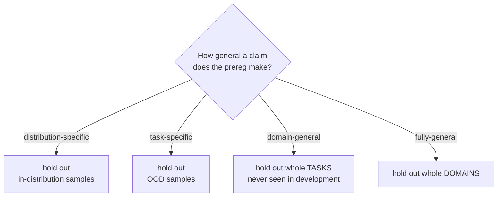

# design-experiment

Decide how many tasks, how many repeats, what is held out, and what it costs — **before** the money is spent. Each of the four is a documented way agent research goes wrong.

## When to use
- After `frame-research-question`, before `validate-eval-task`.
- When someone asks "how many tasks do we need?" or "is 3 runs enough?"
- NOT for choosing what to measure (that is the prereg) and NOT for tabular ML sizing (`split-dataset` handles that world).

## Contract (important)
- **Holdout must match the claim.** The script refuses a mismatch. Claiming `domain-general` while holding out only shifted samples is how agents that took shortcuts came to look general.
- **K ≥ 3 or an explicit ack.** LLM agents are non-deterministic even at temperature 0 (hardware, batching, API behaviour), so one run is one *sample*, not one result.
- **Cost is a design constraint, not a footnote.** Over budget is a refusal, with the max feasible task count reported.
- **Never fix an over-budget design by cutting K to 1.** That trades the error bars for task count, which is precisely the trade that produced a literature without error bars.
- **The assumptions are recorded, not hidden.** `baseline_rate`, `ICC` and `paired_discordance` are guesses until a pilot measures them; `analyze-trials` reports the *observed* ICC so the guess gets checked.

## The holdout table (this is the whole game)



In the surveyed benchmarks only **1/8** domain-general and **0/2** fully-general ones held out the right level.

## Steps
1. **Read the prereg** for the generality level and the minimum effect. The script verifies the prereg's own hash and refuses a hand-edited file.
2. **Get a pilot estimate of the baseline rate and the per-run cost.** Guessed inputs give a guessed sample size; say so if there is no pilot.
3. **Run it:**
   ```bash
   .venv/bin/python "${CLAUDE_PLUGIN_ROOT}/skills/design-experiment/scripts/design.py" \
       --prereg <dir>/prereg.json --baseline-rate 0.40 --n-tasks 300 --k-runs 5 \
       --cost-per-run 0.05 --budget-usd 500 --holdout unseen-tasks --paired \
       [--paired-discordance 0.25] [--icc 0.5] [--ack-single-run]
   ```
4. **Prefer `--paired`** (both configs on the same tasks) — it removes task-difficulty variance and needs far fewer tasks for the same power.
5. **Read the effective sample size, not the row count.** N×K is not N×K independent observations.
6. **If UNDERPOWERED**, say so out loud and decide deliberately: add tasks, raise the effect size you care about, or accept that a null will be *uninformative* rather than negative.

## Output style
- Lead with: tasks needed vs tasks planned, and the powered/underpowered verdict.
- Always state the effective N next to the naive N — the gap is the point.
- Quote the projected cost in dollars against the budget.

## Grounding
Two-proportion and paired sample-size formulas, α=0.05 / power=0.80; design effect `1+(K−1)·ICC` for clustered observations. Holdout levels and the cost-as-constraint argument: Kapoor et al., *AI Agents That Matter* (arXiv 2407.01502). Clustered standard errors, paired analysis as "free" precision, and power analysis for evals: Miller, *Adding Error Bars to Evals* (arXiv 2411.00640) — where cluster-adjusted errors ran up to 3× the naive ones. Scale of agent eval cost: *Holistic Agent Leaderboard* (arXiv 2510.11977), ~$40k for 21,730 rollouts.
