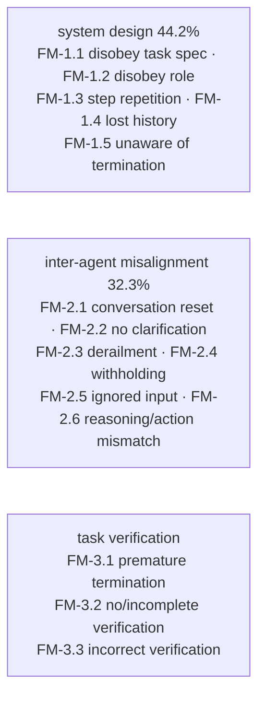

# diagnose-failures

A success rate says the agent fails; it does not say **where**, and where is the insight. This turns traces into a taxonomy — and refuses to bless one that has not been checked between annotators.

## When to use
- After `analyze-trials`, when the question is "what is actually going wrong?"
- Before designing the next ablation: the failure distribution tells you which component to cut next.
- NOT for measuring how often it fails (that is `analyze-trials`) and NOT for security failures (`agent-redteamer`).

## Contract (important)
- **Two independent annotators, or it is not a finding.** MAST's taxonomy is citable because two people labelled independently and agreed at **κ = 0.88**. With one annotator there is no way to separate a real pattern from one reader's habit.
- **Cohen's kappa is a gate.** Below `--kappa-threshold` (default 0.6) the output is stamped `validated: false`, `reportable: false`, and `write-findings` renders it as an observation, not a result.
- **Never reconcile by averaging two disagreeing readings.** Reconcile the *definitions* on a handful of traces, then re-label.
- **`INFRA` rows are not agent failures.** Leaving them in the denominator understates the agent; silently removing them overstates it. Report both counts.
- **A taxonomy describes a sample, not a population.** It carries no confidence interval and must not be reported as though it did.

## The taxonomy (MAST — 14 modes, 3 categories)



Plus `INFRA` (harness fault, not the agent) and `OTHER` (extend the taxonomy deliberately rather than forcing a fit).

**Most failures were system design, not model capability.** A distribution that lands almost everything on "the model isn't smart enough" usually means the labelling never looked at the orchestration.

## Steps
1. **Emit the sheet** (failures sampled stratified by config, so one arm does not dominate):
   ```bash
   .venv/bin/python "${CLAUDE_PLUGIN_ROOT}/skills/diagnose-failures/scripts/diagnose.py" \
       --trials <bundle>/trials.jsonl --sample 100 --emit-sheet --out-dir <dir>
   ```
2. **⏸ CHECKPOINT — two humans label independently.** Each fills the `label` field with a MAST code, reading the trace at `trace_path`. They must not see each other's labels; that is what makes the agreement statistic mean anything.
3. **Compute agreement and the distribution:**
   ```bash
   .venv/bin/python "${CLAUDE_PLUGIN_ROOT}/skills/diagnose-failures/scripts/diagnose.py" \
       --trials <bundle>/trials.jsonl --labels-a a.jsonl --labels-b b.jsonl \
       [--kappa-threshold 0.6] --out-dir <dir>
   ```
4. **If κ is low, fix the taxonomy, not the numbers.** Low agreement means the two people are applying different definitions.
5. **Read the categories against the design.** A mode concentrated in one arm suggests the next ablation; it does not establish that the arm caused it.

## Output style
- Lead with the validation badge and κ — before any percentage.
- If unvalidated, say plainly that the shares are one reader's opinion and must not be cited.
- Separate `INFRA` counts from agent failures explicitly.
- Flag labels that fell outside the taxonomy rather than hiding them in `OTHER`.

## Grounding
Taxonomy, category shares and the method: Cemri, Pan, Yang et al., *Why Do Multi-Agent LLM Systems Fail?* (arXiv 2503.13657) — 1,642 annotated traces across 7 frameworks, 14 modes in 3 categories, inter-annotator κ = 0.88, with system-design issues at 44.2% and inter-agent misalignment at 32.3%. Cohen's kappa is the standard chance-corrected agreement statistic; the implementation here is verified against a hand-computed 2×2 case. Reliability beyond a single success metric (consistency, robustness, predictability, safety) is developed in *Towards a Science of AI Agent Reliability* (arXiv 2602.16666).
