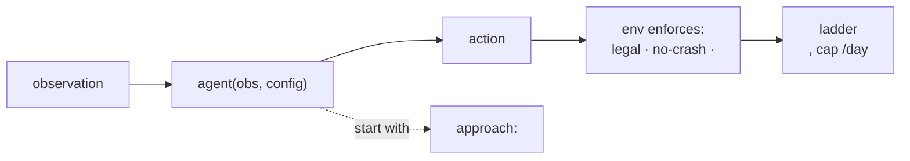

# Agent Task Brief — <competition name>

> <competition URL> · runtime: <kaggle_environments | custom | unknown> · env id: `<env_id or ❓ OPEN>`
> Drafted by `frame-agent-task`. Machine-readable companion: `agent_task.json`.

## At a glance
<!-- Fill every node with real values; do not leave placeholders. -->

**TL;DR:** <one sentence: what you build, how it's scored, and the starting approach.>

## Interface (verified from <source>)
- **Entry point:** `agent(obs, config)` in `main.py` (also accepts `agent(obs)`).
- **Observation carries:** <fields; where legal moves live>.
- **Action to return:** <exact format — index / move list / deck of 60 ids / …>.
- **Legal-move set:** <how to read the legal actions from obs>.

## Hard constraints (the env enforces these)
- **Never crash** → a crash forfeits the episode (costs rating).
- **Legal action only** → illegal/late actions are marked `INVALID` and penalized.
- **Time budget:** model = `<episode | per_move>`, budget = `<N> ms`, overage buffer = `<N> ms`. Memory: `<limit or n/a>`.

## Scoring & submission
- **Ladder:** `<TrueSkill | ELO | …>` — continuous head-to-head; only your best bot shows.
- **Daily submission cap:** `<N>` per day. **Re-read on the live page before submitting.**

## Approach gate
- **Chosen starting approach:** `<scripted | search | rl>`.
- **Why:** <one line — default is scripted; feasibility ≠ competitiveness>.
- Revisit after `baseline-agent` measures the scripted floor.

## ❓ OPEN / unknowns
- <each unverified fact — scaffold-submission will scaffold conservatively around these>

## Next
→ `scaffold-submission` (generate a submittable bundle around these facts).
