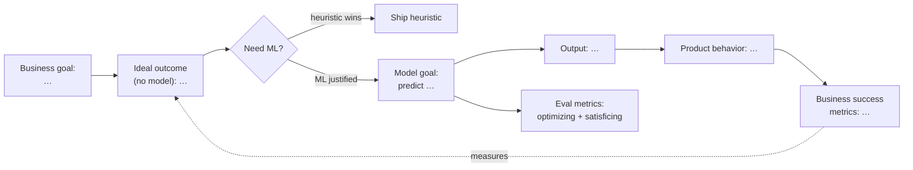

# Problem Framing Brief — <project name>

> Stage 1 deliverable. No model has been built. This brief defines the problem and what "success" means, so we can decide whether and how to proceed.
> Mark anything not yet answered as `❓ OPEN`.

**Date:** <YYYY-MM-DD> · **Owner:** <name> · **Stakeholders:** <names>

---

## Framing at a glance
<!-- Fill the placeholders. This diagram IS the brief in one picture; the sections below are the detail. -->

---

## 1. Context & ideal outcome
- **Business / product goal (plain language):** <why are we doing this; what decision or action does it serve>
- **Who is the user / consumer of the output:** <person or system>
- **Ideal outcome (independent of any model):** <what the product should achieve — NOT "predict X">

## 2. Do we even need ML?
- **Existing non-ML solution / heuristic:** <describe, or "none yet">
- **If none, the simplest heuristic we could ship:** <rule / lookup / threshold>
- **Benchmark to beat:** <the heuristic's current/estimated performance>
- **Verdict:** ☐ heuristic-first  ☐ ML-justified  ☐ prototype-to-decide
- **Why:** <does ML justify the added cost & complexity over the heuristic?>

## 3. Model goal & output  *(only if ML cleared the gate)*
- **What the model predicts / does:** <one sentence>
- **Task type:** <binary / multiclass classification · regression · ranking · recommendation · generation · sequential decision (RL) · …>
- **Output format:** <score 0–1 · label · ranked list · numeric value · action · …>
- **How the output becomes product behavior:** <threshold / decision rule that turns output into action>

## 4. Success metrics — BUSINESS  *(distinct from §5)*
| Success metric | Target | How measured / instrumented | Improves if model improves? |
|---|---|---|---|
| <e.g. % of estimates users trust> | <e.g. ≥ 80%> | <event log / survey / A-B> | <yes — explain the link> |

> Instrument these on the **current** system *before* building the model (Rules of ML #2).

## 5. Evaluation metrics — TECHNICAL
- **Optimizing metric (single number to maximize):** <e.g. F1 / AUC / RMSE>
- **Satisficing metrics (must merely clear a threshold):**
  - <e.g. p99 latency ≤ 100 ms>
  - <e.g. model size ≤ 50 MB>
  - <e.g. fairness gap ≤ x across groups>

## 6. Constraints
- **Latency / throughput:** <…>
- **Cost / compute budget:** <…>
- **Interpretability / explainability:** <required? for whom?>
- **Privacy / fairness / regulatory:** <…>

## 7. Risks & failure modes
- **Potential data leakage** (info not available at prediction time): <fields/sources to watch>
- **Cost of a wrong prediction:** <what breaks downstream>
- **Worst-case failure mode:** <confidently-wrong behavior and its blast radius>

## 8. Decision & next step
- **Recommendation:** <ship heuristic / build model / run prototype>
- **❓ OPEN questions blocking progress:** <list>
- **Next skill / action:** <profile + clean data → `split-dataset` · ship heuristic + instrument · time-boxed prototype>
