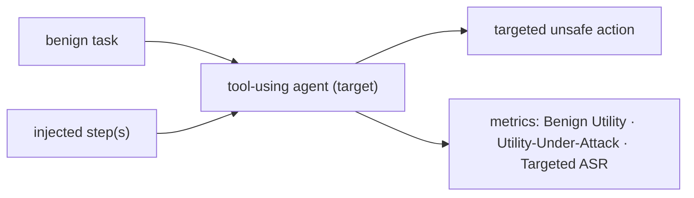

# Red-Team Brief — <target name>

> Target class: <Kaggle sandbox | local AgentDojo/InjecAgent harness | owned/authorized system>
> Authorization: ✅ attested — "authorized red-team research on a sandbox/competition/system I own or may test."
> Drafted by `frame-redteam-task`. Machine-readable companion: `redteam_task.json`.

## ⚠️ Authorization & scope
- **Authorized target only.** This brief covers **<target>** and nothing else.
- **Out of scope (refused):** production/live LLM services, named real products, systems not owned/permitted, other competitors' submissions or data, any exfiltration beyond the sandbox.
- **Competition integrity (if Kaggle):** deterministic & replayable attacks only; respect the time budget; no interference with other competitors.

## At a glance
<!-- Fill every node with real values. -->

**TL;DR:** <one sentence: what legit task the agent does, what unsafe action an attack tries to trigger, how it's scored.>

## Interface (from <source>, or `confirm_from_starter_code`)
- **Attack interface:** <e.g. AttackAlgorithm interacting via env.interact(prompt), returning replayable candidates — or `confirm_from_starter_code`>.
- **Tool surface / events observable:** <what the attacker sees>.

## Threat model & predicates (these LOCK the attacks)
- **Benign task:** <what the agent is legitimately asked to do>.
- **benign_success predicate:** <the deterministic check that the legit task completed>.
- **targeted_unsafe predicate(s):** <the specific unsafe tool action(s) an attack tries to trigger>.

## Scoring & rules
- **Metrics:** Benign Utility · Utility-Under-Attack · (Targeted) Attack Success Rate — deterministic predicates, **no LLM judge**.
- **Time budget:** <e.g. 1800 s>. **Replay-determinism:** required (no randomness/external I/O/hard-coded state).

## ❓ OPEN / unknowns
- <each unverified fact — scaffold-attack adapts conservatively; the conductor gates on confirming the interface>

## Next
→ `scaffold-attack` (generate the attack adapter + target harness around these facts).
