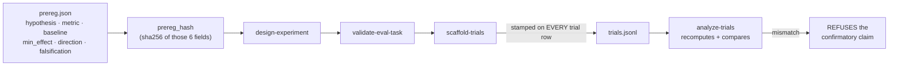

# frame-research-question

Turn "I wonder whether X helps" into a claim that can be **proven wrong**. This is the cheapest stage and the one that decides whether everything after it means anything.

## When to use
- The FRAME step of a research round, before `design-experiment`.
- Any time you are about to compare two agent configurations and want the comparison to be defensible later.
- NOT for exploratory poking (that is fine, just don't call it a result) and NOT for reading other people's papers — that is `paper-researcher` / `discover-papers`.

## Contract (important)
- **The prereg is immutable.** The script refuses to overwrite an existing `prereg.json`. Changing it requires `--amend "<reason>"`, which **records** the change and the superseded values rather than hiding them.
- **Exactly one primary metric.** Several primary metrics means whichever one wins gets reported. The rest are recorded as `secondary_metrics_exploratory` and can never carry a confirmatory claim.
- **A minimum effect size is mandatory and must be > 0.** With a threshold of 0, every non-zero difference "supports" the hypothesis and nothing can refute it.
- **A falsification criterion is mandatory.** If you cannot say what result would change your mind, you do not have a hypothesis.
- **Never claims the question is worth asking.** Preregistration blocks p-hacking; it does not block bad ideas.

## Why the hash matters



Post-hoc metric selection is what HARKing looks like in ML. The hash makes it *detectable* instead of invisible.

## Steps
1. **Get the comparison straight.** What is the treatment, what is the baseline, and what single number decides it? If the user says "better", ask better *at what*, *than what*, *by how much*.
2. **Pin the minimum effect.** Ask: "how much smaller could the gain be before you would not bother shipping it?" That number is `--min-effect`, and it later separates SUPPORTED from BELOW_THRESHOLD.
3. **Write the refutation.** Concretely: "the paired difference CI includes 0, or its upper bound is below +5 points."
4. **Choose the generality level** you intend to claim — this sets the holdout requirement in the next stage, so a bigger claim costs more:
   `distribution-specific` · `task-specific` · `domain-general` · `fully-general`.
5. **Register it:**
   ```bash
   .venv/bin/python "${CLAUDE_PLUGIN_ROOT}/skills/frame-research-question/scripts/prereg.py" \
       --hypothesis "<one sentence>" --primary-metric <metric> --baseline "<named baseline>" \
       --min-effect 0.05 --direction increase --falsify "<what would refute this>" \
       [--secondary-metric <m>] [--generality task-specific] [--out-dir research_experiments/<slug>]
   ```
   (If `${CLAUDE_PLUGIN_ROOT}` is unset, use `skills/frame-research-question/scripts/prereg.py`.)
6. **Read back the locked claim** and the hash. Everything downstream is now bound to it.

## Output style
- Lead with the locked claim in one line: metric, direction, threshold, baseline.
- State the hash and say plainly what it buys: a later edit becomes detectable, not impossible.
- Never soften the refusals into suggestions — a hypothesis with three primary metrics is not "less rigorous", it is untestable.

## Grounding
HARKing — presenting post-hoc hypotheses as a priori, and dropping unsupported ones — is defined in Kerr (1998); its ML forms are post-hoc metric selection and benchmark gaming (*HARK Side of Deep Learning*, arXiv 1904.07633). Preregistration works when hypothesis, design and analysis plan are fixed **before** data collection. The generality levels come from Kapoor et al., *AI Agents That Matter* (arXiv 2407.01502).
