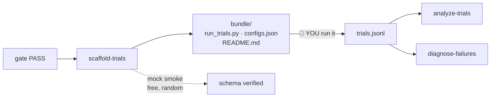

# scaffold-trials

Generate the harness that produces `trials.jsonl`, then hand it over. **It scaffolds; it does not run.** Real rollouts are your API budget, exactly as `cv-modeler`'s `scaffold-train` hands GPU-hours back to you.

## When to use
- After `validate-eval-task` returns `gate: PASS`.
- When you need a runner that is resumable, budget-capped and reproducible rather than a loop someone wrote in a notebook.
- NOT for running the experiment (that is yours) and NOT for tabular training (`baseline` / `train-tune`).

## Contract (important)
- **Refuses unless the gate is PASS, and re-derives that gate from the audit's own contents** (recorded failures, trivial-agent rates, oracle rate) — so hand-flipping `"gate": "PASS"` while leaving the failures in place does not get through.
- **Refuses if the prereg hash moved** since the validity audit — the hypothesis changed after the task was audited.
- **`produces_results: false`.** The smoke run uses a built-in mock agent whose outcomes are random by construction. A green smoke proves the plumbing, never a result.
- **The smoke test verifies OUTPUT, not exit code.** It parses the rows and asserts every required field is present.
- **You write three functions, and they are yours for a reason:** `load_tasks()` must return the **holdout** the design requires; `run_agent()` must vary *only* `config` between arms; `reset_env()` must clear state between runs.

## The trials.jsonl contract (the composition boundary)

One row per **single run** — every downstream skill reads only this:

`task_id · config_id · run_idx · success · cost_usd · latency_s · n_llm_calls · model_version · prereg_hash · config_hash · error · trace_path · order_seed`



## What the generated runner already handles
- **Resume** — re-running skips `(task_id, config_id, run_idx)` triples already present, so an interruption costs nothing twice.
- **Hard budget stop**, with an explicit warning that a truncated grid is *not* missing at random.
- **Per-line flush** — a crash keeps every run already paid for.
- **A recorded order seed** — task order is not neutral. WebArena's Reddit clone rate-limits consecutive posts, silently failing whichever agent went last.
- **Errors recorded as data**, not dropped. A crashed run is a failure with a reason, not a gap.

## Steps
1. **Confirm the gate:** `jq .gate <dir>/task_validity.json` must be `"PASS"`.
2. **Pin the model version including its date.** "The latest model" is not reproducible; endpoints drift.
3. **Generate:**
   ```bash
   .venv/bin/python "${CLAUDE_PLUGIN_ROOT}/skills/scaffold-trials/scripts/scaffold_trials.py" \
       --prereg <dir>/prereg.json --design <dir>/experiment_design.json \
       --task-validity <dir>/task_validity.json \
       --model-version "claude-opus-5-2026-05-01" \
       [--config baseline --config treatment] --out-dir <dir>/trials_bundle
   ```
4. **Check the smoke line** — rows produced and all required fields present. If it failed, do not point the bundle at a paid API.
5. **⏸ CHECKPOINT — hand it to the human.** They wire `load_tasks()` / `run_agent()` / `reset_env()` and run it. State the projected cost again here.
6. **When `trials.jsonl` comes back**, go to `analyze-trials`.

## Output style
- Lead with the bundle path, the gate, and the smoke result.
- Restate `produces_results: false` and that mock rows are random — never let a smoke run be read as an outcome.
- Repeat the dollar figure at the checkpoint. It is the last moment before money is spent.

## Grounding
Scaffold-don't-run mirrors this plugin's `scaffold-train` (GPU-hours are the user's) and the cost reality of agent evals: ~$40k for 21,730 rollouts in the *Holistic Agent Leaderboard* (arXiv 2510.11977), and >$8,000 for a single SWE-bench run at SWE-Agent's $4/task cap. Task-order dependence (WebArena rate limits), non-standard evaluation scripts and missing error bars are the reproducibility root causes catalogued in Kapoor et al., *AI Agents That Matter* (arXiv 2407.01502). State clearing between runs is ABC T.4 (arXiv 2507.02825), which KernelBench violated by leaving ground truth in GPU memory.
