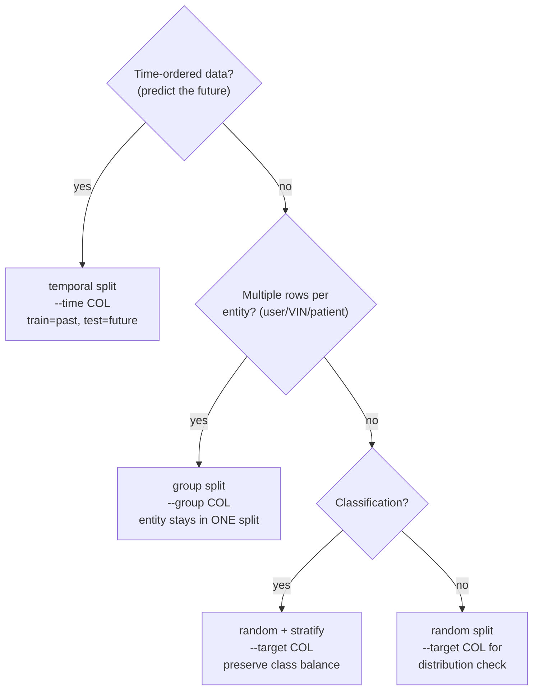

# split-dataset

Turn one clean table into **train / val / test** without leaking. This is the highest-leverage, lowest-visibility step in the pipeline: get the split wrong and every metric downstream is optimistic fiction — the model looks great offline and fails in production. Data leakage is the single most common cause of ML results that don't reproduce.

This skill chooses the split *method* to match how the data leaks, runs a bundled script, and writes the splits plus a verifiable report.

## When to use
- Right after `profile-dataset` / `clean-data`, before any baseline or modeling.
- Any time data has **entities** (multiple rows per user/customer/VIN/patient), a **time** dimension, or **class imbalance** — i.e. almost always.
- When metrics look suspiciously good and you suspect train/test contamination.

## Contract (important)
- **READ-ONLY on the source.** Writes new files into `<name>_splits/`; never overwrites input.
- **Clean first.** Assumes profiling/cleaning is done. Splitting dirty data just splits the mess.
- **Reproducible.** Always a fixed `--seed`; the report records method, ratios, and seed.
- **The split is not where you scale.** This skill must NOT fit scalers/encoders/imputers. That happens later, **on train only** — the report restates this discipline.

## Pick the method (this is the whole game)



- **Temporal** beats group beats stratified-random when more than one applies (a random split of time-series leaks the future into training).
- **Group** prevents the same entity appearing in both train and test — a classic, invisible leak.
- **Stratify** keeps class proportions equal across splits; essential for imbalanced targets.

## Steps
1. **Confirm the data is clean** (profiled/cleaned). If not, send the user to `profile-dataset` / `clean-data` first.
2. **Ask the 3 questions** that pick the method: (a) is there a **time** column you predict forward from? (b) are there **repeated entities** (a group key)? (c) is the target **classification** (stratify) or regression? Also note class imbalance and dataset size.
3. **Propose the split plan** — method, target, group/time column, ratios, seed — and confirm. Default ratios `0.7/0.15/0.15`; for very large data (≫100k rows) shrink val/test fractions (Ng: the *fraction* drops as absolute counts stay ample), e.g. `0.9,0.05,0.05`.
4. **Ensure deps & run:**
   ```bash
   python3 -c "import pandas, sklearn" 2>/dev/null || pip install pandas scikit-learn pyarrow openpyxl
   python3 "${CLAUDE_PLUGIN_ROOT}/skills/split-dataset/scripts/split.py" "<clean-file>" \
       --target <col> [--task auto] [--group <col>] [--time <col>] \
       [--ratios 0.7,0.15,0.15] [--stratify auto] [--drop-duplicates] [--seed 42]
   ```
   (If `${CLAUDE_PLUGIN_ROOT}` is unset, use `skills/split-dataset/scripts/split.py`.)
5. **Verify the report** — open `split_report.md`. Confirm: no row overlap, no group overlap (group method), class balance / target distribution comparable across splits, duplicates handled. Flag anything off before declaring done.
6. **Hand off with the discipline reminder:** downstream, fit all transforms on **train only**. Recommend `baseline` next.

## Output style
- Lead with the method choice and *why* (one line), then the split sizes.
- Surface the leakage checks explicitly — that's the point of this skill, not the file paths.
- Point to `split_report.md` (it opens with the Mermaid split diagram) and the three files.

## Grounding
Verified practice: dev & test from the **same distribution** and dev set **sized to detect model differences** (Andrew Ng, *Machine Learning Yearning* Ch.6–7); leakage as information unavailable at prediction time, avoided by a **learn-predict separation** (Kaufman et al., ACM TKDD 2012; Kapoor & Narayanan, *Patterns* 2023 — where fixing leakage erased the apparent gains of complex models over logistic regression).
