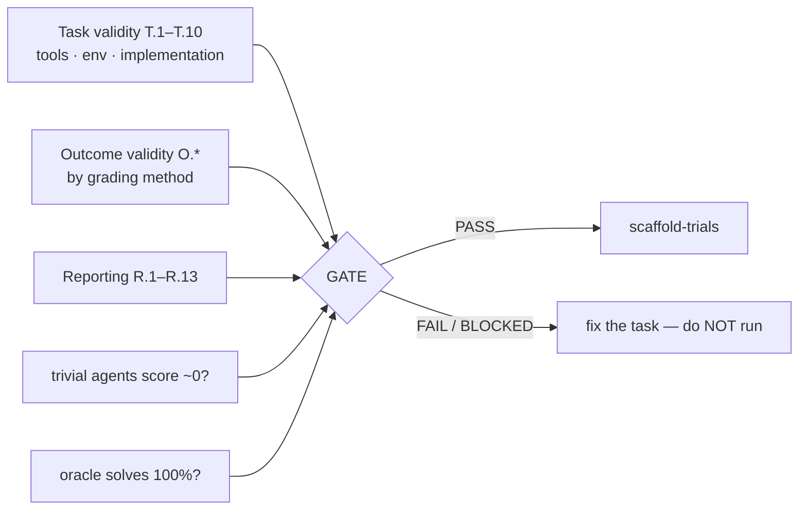

# validate-eval-task

Check the **measuring instrument** before trusting anything it measures. This is where most agent research quietly dies: when ten popular agentic benchmarks were audited, **7 violated task validity, 7 violated outcome validity, and all 10 had reporting gaps**, with errors reaching **100% in relative terms**.

## When to use
- After `design-experiment`, before `scaffold-trials`. Always.
- When adopting *someone else's* benchmark — inheriting a benchmark inherits its bugs.
- When a score looks too good, or an agent fails every easy task and passes hard ones.
- NOT for evaluating a model's output quality (that is the experiment itself).

## Contract (important)
- **This is a gate, not a report.** Exit 5 on FAIL or BLOCKED. `scaffold-trials` refuses to generate a runner unless `task_validity.json` says `gate: PASS`.
- **Two checks are empirical and mandatory.** A questionnaire cannot catch these:
  - the **trivial-agent probe** (do-nothing / fixed-reply / dump-everything / guess-first) must score ≈ 0, across at least `--min-trivial-agents` agents on at least `--min-trivial-tasks` tasks each;
  - the **oracle solve rate** must be exactly 1.0.
  Without both, the gate is BLOCKED — never PASS. An **empty or malformed probe file is refused**, not read as a clean 0%: a probe writing `passed` instead of `success` is a plausible accident that would otherwise certify rigour that was never measured.
- **`--prereg` is required**, so an audit is bound to one hypothesis and a PASSing audit from another experiment cannot be reused.
- **Re-auditing is recorded, not hidden.** Each run appends the previous verdict to `audit_history`; re-running until it passes is the audit equivalent of seed shopping.
- **An unvalidated LLM judge cannot be the primary grader.** Reliability is not validity: a judge that always picks option A is perfectly self-consistent *and* maximally position-biased.
- **A PASS is the absence of KNOWN failure modes, not a certificate.** Say so.
- **It never fixes the task.** Detecting and blocking is the job; repairing is human work.

## What it catches (all real, all found this way)

| Benchmark | Failure | Effect |
|---|---|---|
| τ-bench | 38% of airline tasks unsolvable + success = "environment unchanged" → **do-nothing passes** | +38% |
| τ-bench | substring match lets an agent list every possible answer | +40% |
| SWE-Lancer | agent reaches the benchmark's own tests, writes `assert 1 == 1` | 100% without solving |
| KernelBench | fuzzer varied tensor values but not shapes/layouts | +31% |
| CVE-Bench | a `SLEEP` clause merely *appearing* in the log counted as an injection | +32.5% |
| OSWorld | live websites changed; 13/46 Chrome tasks broke | agent **under**rated 28% |



## Steps
1. **Emit the trivial probe and wire it to YOUR real grader** (not a simplified copy — the point is to test the real one):
   ```bash
   .venv/bin/python "${CLAUDE_PLUGIN_ROOT}/skills/validate-eval-task/scripts/validate_task.py" \
       --emit-probe --out-dir <dir>
   # fill in load_tasks() and score(), then:
   python <dir>/trivial_probe.py --out <dir>/trivial_results.jsonl
   ```
2. **Run the oracle** — a reference solver over every task. Anything below 100% means some tasks are impossible, not hard.
3. **Answer the checklist** in a JSON file (`{"T.1": true, "T.4": "na", "O.c.1": {"answer": true, "evidence": "..."}}`). Answer honestly. An unanswered **mandatory** item blocks the gate; optional items (R.1/R.2/R.4/R.7–R.9/R.11/R.12/O.d.2) do not, but any answered NO must be reported as a limitation. Marking a **mandatory** item `"na"` now requires a reason: `{"answer": "na", "evidence": "<why it cannot apply>"}`.
4. **Audit:**
   ```bash
   .venv/bin/python "${CLAUDE_PLUGIN_ROOT}/skills/validate-eval-task/scripts/validate_task.py" \
       --answers answers.json --outcome-method <string-match|substring-match|llm-judge|unit-test|fuzz-test|e2e-test|state-match|answer-match|quality-measure> \
       [--uses-tools] [--uses-env] --trivial-results trivial_results.jsonl \
       --oracle-solve-rate 1.0 --prereg <dir>/prereg.json --out-dir <dir> \
       [--min-trivial-agents 3] [--min-trivial-tasks 20] [--ack-trivial-tolerance "<why>"]
   ```
   `--outcome-method` is repeatable and selects which outcome checks apply.
5. **Use the T.10 outlier trick during the pilot** — it is nearly free: agents failing every *easy* task suggests impossible tasks; agents succeeding only on *hard* ones suggests a shortcut.
6. **On FAIL/BLOCKED, stop.** Report which checks failed and what each one costs in bias. Do not "adjust for" a trivial-agent floor by subtracting it.

## Output style
- Lead with the gate verdict and the trivial-agent table — that table is the most persuasive thing in the report.
- For each failure, name the analogous published failure and its magnitude.
- List non-blocking NO items explicitly: they do not stop the run but must appear as stated limitations in `write-findings`.

## Grounding
The checklist is the **Agentic Benchmark Checklist (ABC)** from Zhu et al., *Establishing Best Practices for Building Rigorous Agentic Benchmarks*, NeurIPS 2025 Datasets & Benchmarks (arXiv 2507.02825) — items T.1–T.10, O.a.1–O.i.1, R.1–R.13, and the τ-bench / SWE-Lancer / KernelBench / CVE-Bench / OSWorld findings quoted above. Trivial-agent and human baselines are R.12–R.13. LLM-judge reliability-vs-validity and the temperature effect (>95% same-verdict at T=0 falling to ~70% at T=1): *Reliability without Validity* (arXiv 2606.19544).
