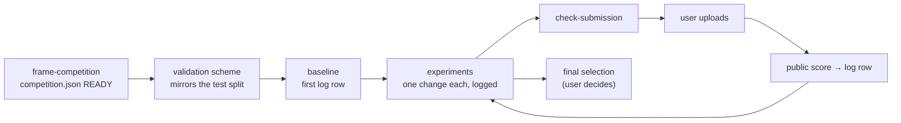

# CLAUDE.md — competition workspace

This folder is one AI competition. The facts about it live in `competition.json`; every experiment lives in `experiments/log.csv`. The skills and agents used here are installed from `claude-research-template` (user-level, `~/.claude/skills/` and `~/.claude/agents/`).

## Start of every session
1. Read `competition.json`, `competition_check.json` and the last rows of `experiments/log.csv`.
2. If `competition.json` has a `null` in a required field, or the check says `INCOMPLETE`, run **`frame-competition`** before anything else.
3. Say the days left to the final deadline. Under 7 days: stop starting new ideas; finish, validate and select.

## Rules (hard)

### 1. The rules page beats everything
- `null` in `competition.json` means **unknown → ask the user**, never "allowed". This matters most for `rules.external_data_allowed` and `rules.pretrained_models_allowed`: using banned data or models disqualifies the team.
- Never share competition code or data outside the team, and never suggest a second account. Both break the rules of every major platform.
- If the rules are unclear, quote the exact rule text and ask; do not interpret it in the team's favour.

### 2. Validation mirrors the test split
- The validation scheme in `competition.json` (`validation.scheme` + `mirrors_test_because`) is the scheme every experiment uses. Change it only with the user, and then re-score the baseline under the new scheme.
- Preprocessing, target encoding and feature selection are fit **inside** each training fold, never on the full training data.
- Data in `data/raw/` is read-only. Derived data goes to `data/processed/`.

### 3. Trust local validation over the public leaderboard
- The public leaderboard scores only part of the test set; the private leaderboard decides the final standing. Chasing public-leaderboard gains overfits to that part (a **shake-up** is the rank change when the private leaderboard is revealed).
- Report every validation score as **mean ± standard deviation across folds**. Call a change an improvement only when the gain is larger than the fold standard deviation; otherwise it is noise until shown otherwise.
- Keep an eye on whether validation and public scores move together. When they disagree repeatedly, suspect the validation scheme first, not the leaderboard.

### 4. One change per experiment, every experiment logged
- Each experiment changes **one** thing against a named parent experiment.
- Append a row to `experiments/log.csv` **before** reporting a result: `experiment_id, date, parent_id, git_commit, change, validation_mean, validation_std, public_score, submitted_file, notes`. Failed and worse experiments are logged too.
- Fix random seeds and commit the code before the run, so `git_commit` reproduces the row.
- The first row is always a baseline (the simplest model that runs end to end).

### 5. Submissions
- Validate every file before the user uploads it: `check-submission` (tabular), `make-detection-submission` (object detection), `scaffold-submission` (agent bundles).
- The user uploads. Never upload, accept rules, or merge teams on the user's behalf.
- Budget the daily limit (`submission.daily_limit`); do not burn submissions probing the leaderboard.
- Code competitions: the final notebook must run within `submission.runtime_limit_hours` and with `submission.internet_allowed` as set (bundle weights as datasets when internet is off).

### 6. Final selection
- When the user asks, propose `submission.final_selection_count` candidates from the log: the best by validation, plus one that is robust or different (another model family or a blend), and say why. The choice is the user's.

### 7. Honesty
- A validation score is not a private-leaderboard score, and a leaderboard score is not production performance. Say so whenever a number could be read that way.
- When a pipeline cannot do something (training a deep model on a GPU, running the live ladder), say so and hand that step to the user.

## Which pipeline
| `competition.json` track | Agent | Last step before upload |
|---|---|---|
| `tabular` | `model-builder` | `check-submission` |
| `game-agent` | `game-agent-builder` | `scaffold-submission` |
| `cv-detection` | `cv-modeler` | `make-detection-submission` |
| `other` | none yet — say so | — |

## Reports
Every report opens with `## At a glance` and a Mermaid diagram, and has a machine-readable JSON sidecar next to it.

## Python environment
Use `.venv/bin/python` in this folder. Create it once: `python3 -m venv .venv`, then install what the track needs (tabular: `pandas numpy scikit-learn scipy pyarrow`; game-agent: `kaggle-environments`; cv-detection: `pillow ultralytics`).
